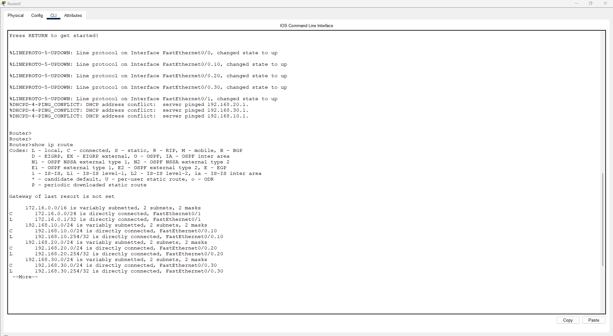

# 🔧 Lab 01 Enterprise Switching

## Overview

A full enterprise switching topology built in Cisco Packet Tracer featuring a three-tier hierarchical network design. This lab covers VLAN segmentation, trunk configuration, VTP propagation, inter-VLAN routing, and DHCP automation across multiple departments.

---

## Topology



### Device Inventory

| Device | Model | Role |
|--------|-------|------|
| Core Switch | Cisco 2960-24TT | Core Layer — VLAN SVI + VTP Server |
| Distribution Switch | Cisco 2960-24TT | Distribution Layer |
| Switch 0 | Cisco 2960-24TT | Access Layer |
| Switch 1 | Cisco 2960-24TT | Access Layer |
| Switch 2 | Cisco 2960-24TT | Access Layer |
| Switch 3 | Cisco 2960-24TT | Access Layer |
| Switch 6 | Cisco 2960-24TT | Server Layer — VTP Transparent |
| Router | Cisco 2811 | Inter-VLAN Routing + DHCP Server |
| PC0 | PC-PT | VLAN 10 IT Client |
| PC1 | PC-PT | VLAN 20 SALES Client |
| PC2 | PC-PT | VLAN 30 HR Client |
| Active Directory | Server-PT | Authentication Server |
| File Server | Server-PT | HR File Storage |

---

## Network Design

### VLAN Table

| VLAN | Name | Network | Subnet Mask | Gateway |
|------|------|---------|-------------|---------|
| 10 | IT | 192.168.10.0 | 255.255.255.0 | 192.168.10.254 |
| 20 | SALES | 192.168.20.0 | 255.255.255.0 | 192.168.20.254 |
| 30 | HR | 192.168.30.0 | 255.255.255.0 | 192.168.30.254 |

### Server Network

| Device | IP Address | Subnet Mask | Gateway |
|--------|-----------|-------------|---------|
| Router Fa0/1 | 172.16.0.1 | 255.255.255.0 | — |
| Active Directory | 172.16.0.10 | 255.255.255.0 | 172.16.0.1 |
| File Server | 172.16.0.20 | 255.255.255.0 | 172.16.0.1 |

### Router Sub-interfaces

| Interface | VLAN | IP Address |
|-----------|------|-----------|
| Fa0/0.10 | VLAN 10 IT | 192.168.10.254 |
| Fa0/0.20 | VLAN 20 SALES | 192.168.20.254 |
| Fa0/0.30 | VLAN 30 HR | 192.168.30.254 |
| Fa0/1 | Server Network | 172.16.0.1 |

---

## Concepts Covered

### 1. Trunking (IEEE 802.1Q)
All switch-to-switch and switch-to-router links configured as trunk ports to carry multi-VLAN traffic over single physical connections.

### 2. VLAN Trunking Protocol (VTP)
- Core Switch → **VTP Server** (creates and pushes VLANs)
- Distribution + Access Switches → **VTP Clients** (receive VLANs automatically)
- Switch 6 → **VTP Transparent** (behind router, manages VLANs independently)

### 3. Router on a Stick
Single physical link between Core Switch and Router carries all VLAN traffic using 802.1Q sub-interfaces — one sub-interface per VLAN.

### 4. DHCP
Router configured as a DHCP server with separate pools for each VLAN. Core Switch uses `ip helper-address` to forward DHCP broadcasts from PCs to the router.

### 5. Static Server IPs
Servers are assigned static IPs in a dedicated 172.16.0.0/24 network, which is standard practice for infrastructure devices that must maintain a permanent address.

---

## Key Commands Reference

### Trunking
```
interface fastethernet 0/1
switchport mode trunk
spanning-tree portfast
```

### Creating VLANs (Core Switch)
```
vlan 10
name IT
interface vlan 10
ip address 192.168.10.1 255.255.255.0
no shutdown
```

### VTP Configuration
```
# Server
vtp mode server
vtp domain ISBAT

# Client
vtp mode client
vtp domain ISBAT

# Transparent (Switch 6)
vtp mode transparent
```

### Router Sub-interfaces
```
interface fastethernet 0/0
no shutdown

interface fastethernet 0/0.10
encapsulation dot1q 10
ip address 192.168.10.254 255.255.255.0
no shutdown
```

### DHCP Pools
```
ip dhcp pool IT
network 192.168.10.0 255.255.255.0
default-router 192.168.10.254
```

### DHCP Helper Address
```
interface vlan 10
ip helper-address 192.168.10.254
```

---

## Verification

### VTP Status
> 📸 **[SCREENSHOT: show vtp status — VTP Domain ISBAT, Mode Client]**

### VLAN Propagation
> 📸 **[SCREENSHOT: show vlan brief — VLAN 10 IT, VLAN 20 SALES, VLAN 30 HR all active]**

### Routing Table


### DHCP Assignment
> 📸 **[SCREENSHOT: PC Desktop showing DHCP assigned IP in correct subnet]**

### Inter-VLAN Routing
> 📸 **[SCREENSHOT: Ping from PC0 VLAN 10 to PC in VLAN 30 — successful]**

### Cross-Router Connectivity
> 📸 **[SCREENSHOT: Ping from PC to AD Server 172.16.0.10 — successful]**

---

## Lessons Learned

- VTP cannot propagate through a router — switches on the other side of a router must be set to VTP Transparent and have VLANs created manually
- DHCP broadcasts are stopped at layer 3 boundaries — `ip helper-address` is required to forward them to the DHCP server
- Servers should always use static IPs — DHCP is for end-user devices only
- Proper subnet planning from the start prevents overlap issues during configuration

---

## Tools Used

- Cisco Packet Tracer 8.x
- Cisco IOS CLI
- Cisco 2960-24TT Switches
- Cisco 2811 Router
