#  Enterprise Network Lab EVE-NG

**Author:** Timothy Lutara  
**Focus:** Network Engineering | Enterprise Switching & Routing | Firewall Integration  
**Platform:** EVE-NG (running on VMware Workstation)  
**Status:**  Complete Full end-to-end connectivity verified

---

## 📌 Project Overview

This lab simulates a full multi-floor enterprise office network built entirely in EVE-NG. The goal was to design, implement, and verify a production-grade network topology covering Layer 2 switching, Layer 3 routing, dynamic routing protocols, DHCP relay, VLAN segmentation, and perimeter firewall integration.

The topology mirrors what you would find in a real small-to-medium enterprise environment with a hierarchical three-tier design (Access → Distribution/Core → Edge), proper VLAN segmentation per floor, centralized DHCP, OSPF dynamic routing, and a FortiGate next-generation firewall providing internet access and NAT.

---

##  Objectives

- Design and implement a multi-VLAN enterprise network with floor-based segmentation
- Configure a hierarchical switching topology using VTP for centralized VLAN management
- Implement Inter-VLAN routing using a Layer 3 core switch with SVIs
- Deploy OSPF dynamic routing between the core switch and edge router
- Configure centralized DHCP on the router with relay agents on the core switch
- Integrate a FortiGate firewall for perimeter security and internet NAT
- Verify full end-to-end connectivity from end hosts to the internet

---

##  Network Topology

```
                        Internet (VMware NAT Cloud)
                                    |
                              [ FortiGate ]
                           port2 (WAN - DHCP)
                           port1 (LAN - 192.168.200.2/30)
                                    |
                              [ Router ]
                          e0/0 → 192.168.200.1/30
                          e0/1 → 192.168.100.2/30
                                    |
                           [ Core Switch ]
                        Gi0/1 → 192.168.100.1/30
                    Gi0/2  Gi0/3  Gi1/1  Gi1/2
                      |      |      |      |
                   SW13   SW14   SW15   SW(Yellow)
                  VLAN10 VLAN20 VLAN30  VLAN40
                    |      |      |      |
                 VPC9   VPC11  VPC7   VPC6
                 VPC10  VPC8   VPC3   VPC12
                                       VPC5
```

---

##  IP Addressing Scheme

| Segment | Network | Gateway | VLAN |
|---|---|---|---|
| Pink Floor (Finance) | 192.168.10.0/24 | 192.168.10.1 | VLAN 10 |
| Green Floor (HR) | 192.168.20.0/24 | 192.168.20.1 | VLAN 20 |
| Blue Floor (Marketing) | 192.168.30.0/24 | 192.168.30.1 | VLAN 30 |
| Yellow Floor (IT) | 192.168.40.0/24 | 192.168.40.1 | VLAN 40 |
| Core ↔ Router Link | 192.168.100.0/30 | — | Routed |
| Router ↔ FortiGate Link | 192.168.200.0/30 | — | Routed |
| FortiGate WAN | 192.168.202.x/24 | 192.168.202.1 | DHCP from NAT |

> /30 subnets are used on point-to-point links between infrastructure devices only 2 usable IPs needed per link.

---

##  Lab Devices & Images

| Device | Role | Image Used | Type |
|---|---|---|---|
| Core Switch | Layer 3 Core | viosl2-adventerprisek9-m.ssa.high_iron_20200929 | QEMU |
| SW13, SW14, SW15, SW(Yellow) | Access Layer | i86bi_linux_l2-adventerprisek9-ms.SSA.high_iron_20180510.bin | IOU |
| Router | Edge Router / DHCP Server | i86bi_LinuxL3-AdvEnterpriseK9-M2_157_3_May_2018.bin | IOU |
| FortiGate | Perimeter Firewall | FortiGate-VM64-KVM | QEMU |
| VPCs | End Hosts | EVE-NG built-in VPCS | — |

---

##  Technologies & Concepts Implemented

### Layer 2
- **VLANs** — Four VLANs configured (10, 20, 30, 40) representing separate floor segments
- **VTP (VLAN Trunking Protocol)** — Core switch configured as VTP Server; all access switches as VTP Clients. VLAN database propagated automatically across the domain
- **802.1Q Trunking** — Explicit trunk configuration on all uplinks with `switchport nonegotiate` to disable DTP (Dynamic Trunking Protocol) for security
- **Access Ports** — VPC-facing ports explicitly assigned to correct VLANs
- **Spanning Tree Protocol** — Core switch configured as STP root bridge for all VLANs

### Layer 3
- **SVIs (Switched Virtual Interfaces)** — Four SVIs on core switch acting as default gateways for each VLAN
- **Routed Port** — Gi0/1 on core switch converted from switchport to routed port (`no switchport`) for the uplink to the router
- **OSPF (Area 0)** — Dynamic routing between core switch and router; all VLAN subnets and point-to-point links advertised
- **Default Route Redistribution** — Router redistributes default route into OSPF (`default-information originate`) so core switch automatically learns internet path
- **DHCP** — Centralized DHCP server on router with pools for all four VLANs
- **DHCP Relay (ip helper-address)** — Configured on each SVI to forward DHCP broadcasts to router as unicast

### Firewall
- **FortiGate Perimeter Firewall** — Separates internal network from internet
- **NAT (Network Address Translation)** — Private VLAN IPs translated to FortiGate WAN IP for internet access
- **Firewall Policy** — Explicit LAN-to-WAN allow policy (FortiGate denies all by default)
- **Static Routing on FortiGate** — Default route out port2 toward internet; return route toward LAN subnets via router

---

##  Screenshots

### Topology
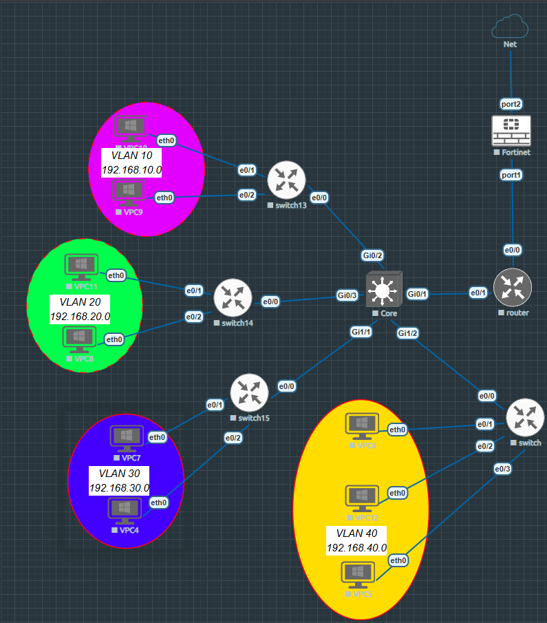
*Full EVE-NG topology showing all devices and connections*

---

### VLAN Configuration
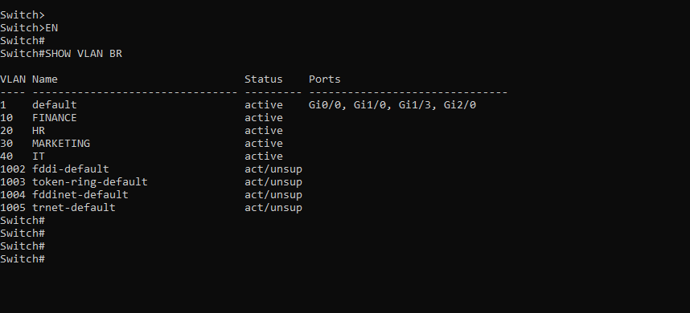
*VLANs 10, 20, 30, 40 created on core switch with correct names*

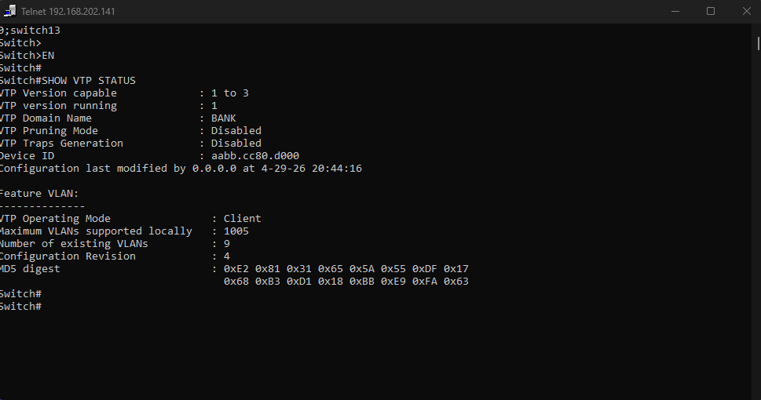
*VTP client mode confirmed on access switch with matching domain and revision number*

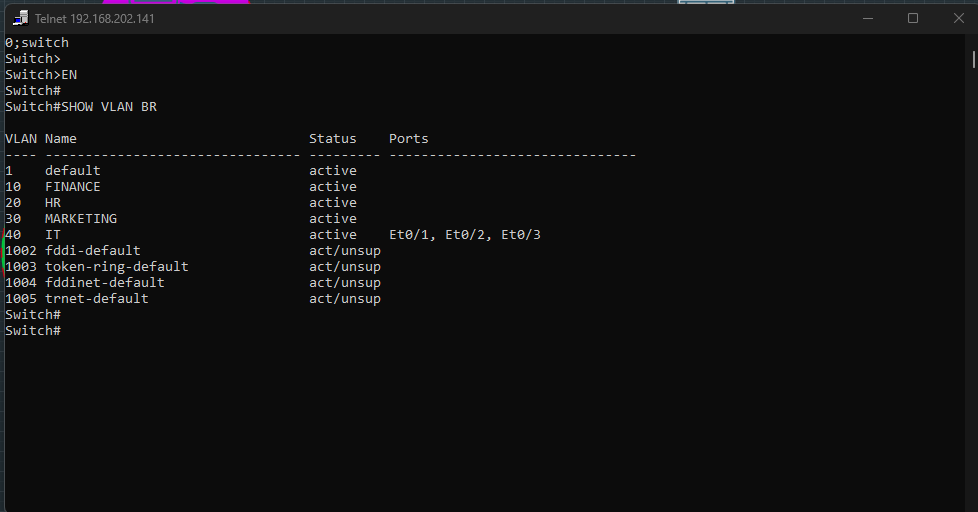
*Access switch showing VPC ports correctly assigned to VLAN 40 (IT floor)*

---

### Trunking
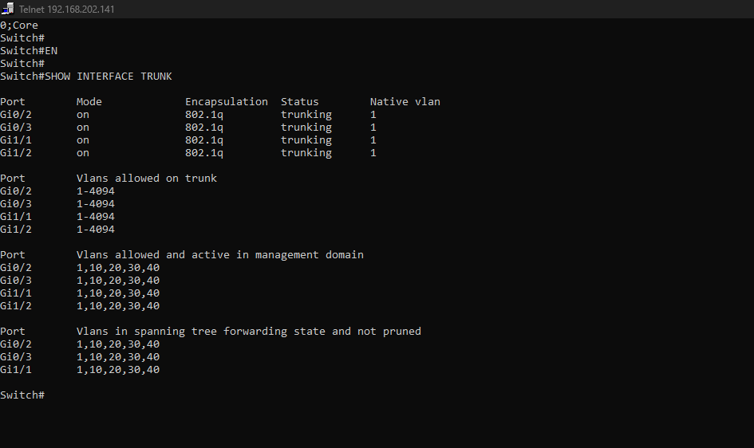
*All four downlink ports trunking with 802.1Q, VLANs 10/20/30/40 active and forwarding*

---

### Layer 3 & Routing
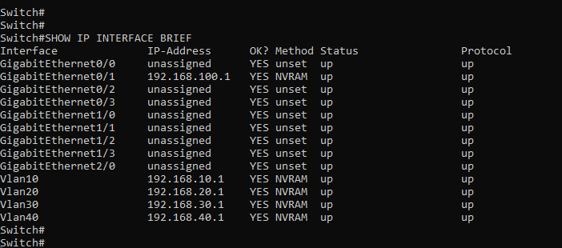
*All four SVIs up/up with correct gateway IPs, Gi0/1 routed port active*

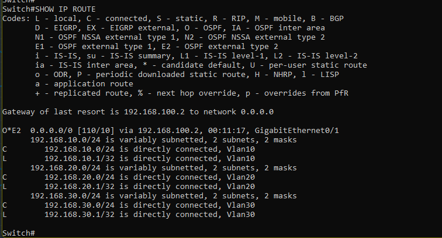
*Core switch routing table showing connected VLAN routes and OSPF default route learned from router*

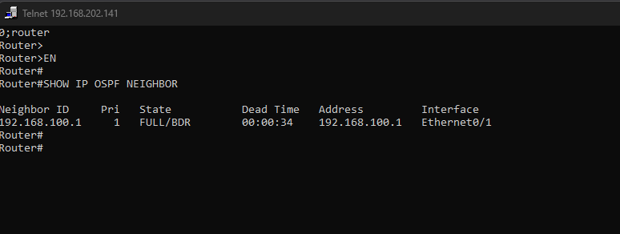
*OSPF neighbor relationship FULL state between router and core switch*

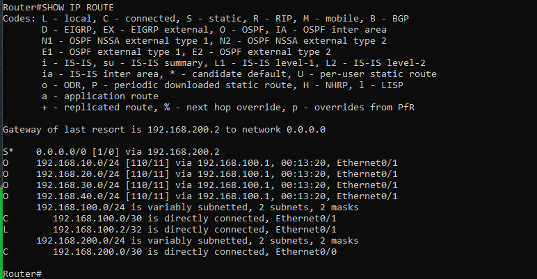
*Router routing table showing OSPF-learned VLAN routes and static default route toward FortiGate*

---

### DHCP
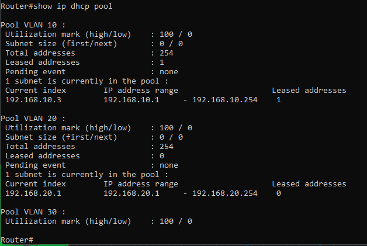
*All four DHCP pools configured with correct networks, gateways, and DNS*

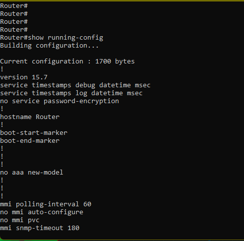
*ip helper-address configured on all four SVIs pointing to router*

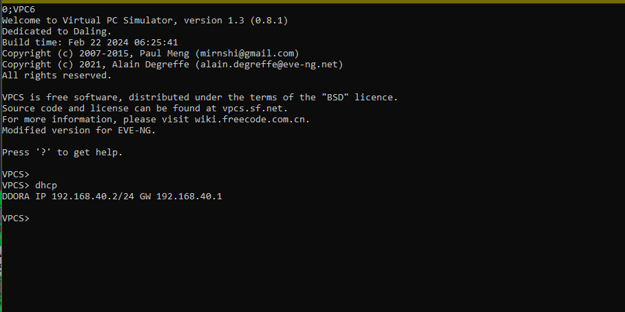
*VPC successfully obtaining IP address via DHCP from router*

---

### FortiGate Firewall
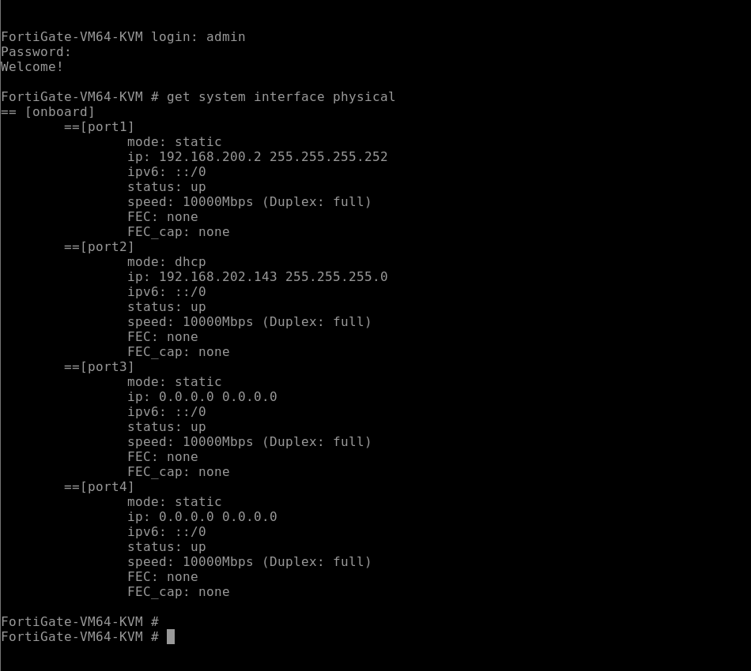
*port1 (LAN) static IP 192.168.200.2/30, port2 (WAN) DHCP from internet*

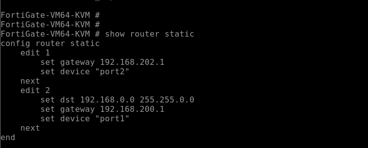
*Default route out port2, return route toward LAN subnets via router*

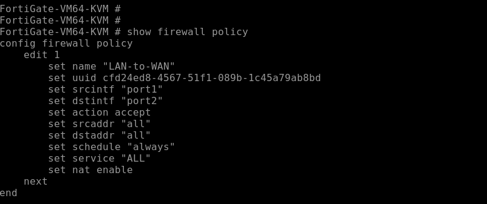
*LAN-to-WAN allow policy with NAT enabled*

---

### Connectivity Verification
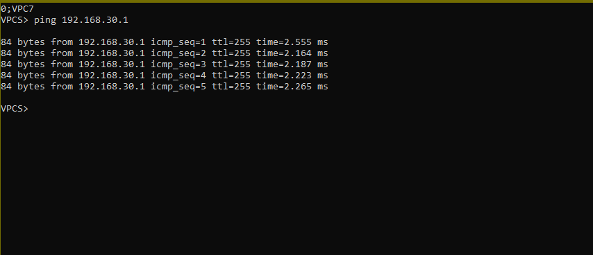
*VPC pinging its default gateway (Core switch SVI)*

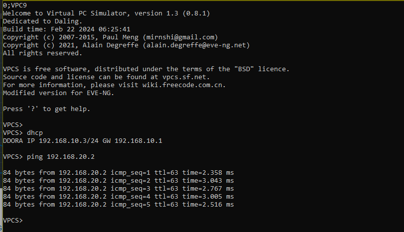
*VPC on VLAN 10 pinging VPC on VLAN 20 — inter-VLAN routing confirmed*

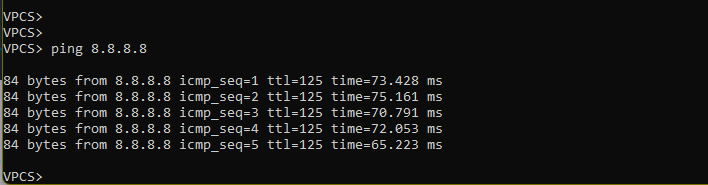
*VPC pinging 8.8.8.8 — full end-to-end internet connectivity through FortiGate confirmed*

---

##  Key Configuration Snippets

### Core Switch — SVI & Helper Address
```
interface Vlan10
 ip address 192.168.10.1 255.255.255.0
 ip helper-address 192.168.100.2
 no shutdown
```

### Core Switch — OSPF
```
router ospf 1
 network 192.168.10.0 0.0.0.255 area 0
 network 192.168.20.0 0.0.0.255 area 0
 network 192.168.30.0 0.0.0.255 area 0
 network 192.168.40.0 0.0.0.255 area 0
 network 192.168.100.0 0.0.0.3 area 0
```

### Router — DHCP Pool
```
ip dhcp excluded-address 192.168.10.1
ip dhcp pool VLAN10
 network 192.168.10.0 255.255.255.0
 default-router 192.168.10.1
 dns-server 8.8.8.8
```

### Router — Default Route & OSPF Redistribution
```
ip route 0.0.0.0 0.0.0.0 192.168.200.2

router ospf 1
 default-information originate
```

### FortiGate — LAN-to-WAN Policy
```
config firewall policy
    edit 1
        set name "LAN-to-WAN"
        set srcintf "port1"
        set dstintf "port2"
        set srcaddr "all"
        set dstaddr "all"
        set action accept
        set schedule "always"
        set service "ALL"
        set nat enable
    next
end
```

---

##  Troubleshooting Encountered & Resolved

| Issue | Root Cause | Resolution |
|---|---|---|
| SVIs administratively down | `no shutdown` not applied after SVI creation | Applied `no shutdown` to all SVIs |
| No trunks forming on core | Core downlink ports not explicitly configured as trunks | Configured trunk on Gi0/2, Gi0/3, Gi1/1, Gi1/2 |
| DHCP failing | `ip helper-address` missing on SVIs | Added helper-address pointing to router on all four SVIs |
| Config lost after restart | `wr` not run after configuration | Established habit of saving after every config block |
| Core switch not routing to internet | Default route not propagated to core | Added `default-information originate` on router OSPF |
| FortiGate console not responding | Telnet console incompatibility | Switched to HTML5 console via EVE-NG web interface |
| ASAv console dead | ASAv 9.20 compatibility issue with EVE-NG | Replaced with FortiGate VM |

---

##  Skills Demonstrated

- Enterprise network design and hierarchical topology planning
- VLAN design and floor-based network segmentation
- VTP domain management and VLAN propagation
- 802.1Q trunk configuration and DTP security hardening
- Layer 3 switching with SVIs and routed ports
- OSPF single-area configuration and neighbor verification
- DHCP server configuration with relay agents across Layer 3 boundaries
- FortiGate firewall initial configuration, interface setup, routing, and policy creation
- NAT configuration for internet access
- Systematic network troubleshooting methodology

---

## 👤 Author

**Timothy Lutara**  
BSc Information Technology (Cybersecurity) — ISBAT University, Kampala  
Targeting: Network Security Engineer | CCNP Security | NSE Certification Path  

[GitHub](https://github.com/your-github-username) | [LinkedIn](https://linkedin.com/in/your-linkedin)
