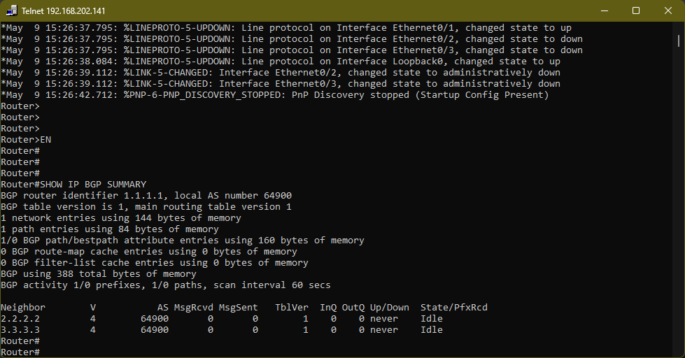
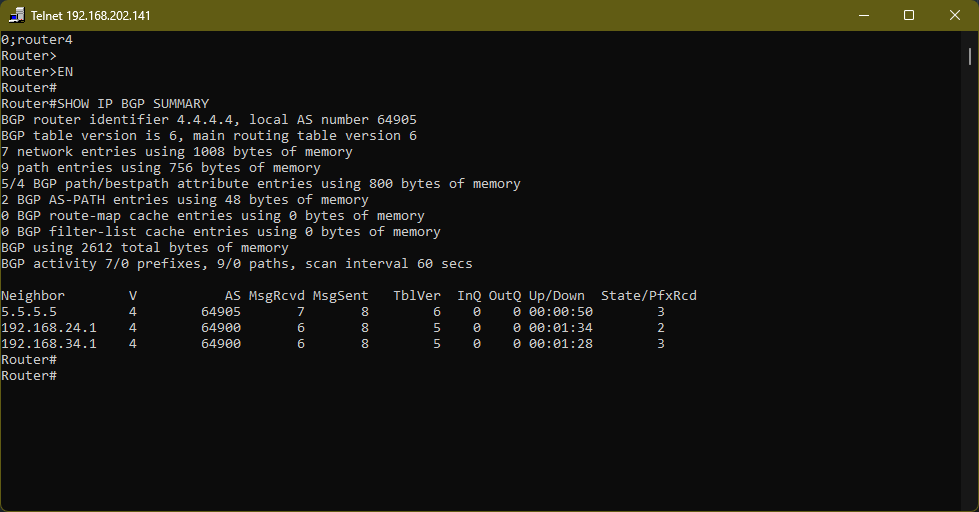
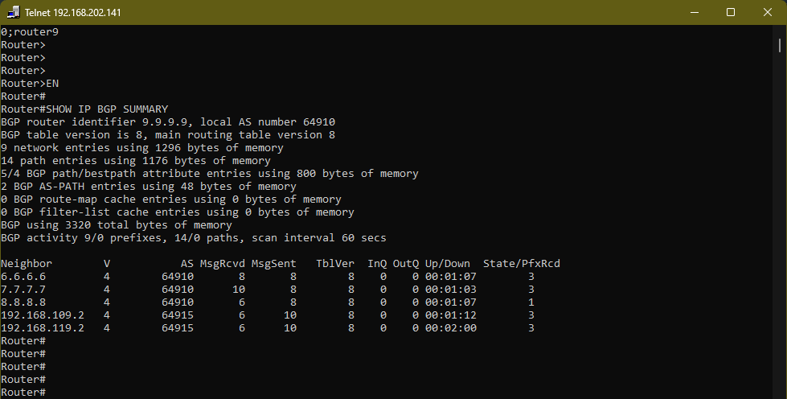
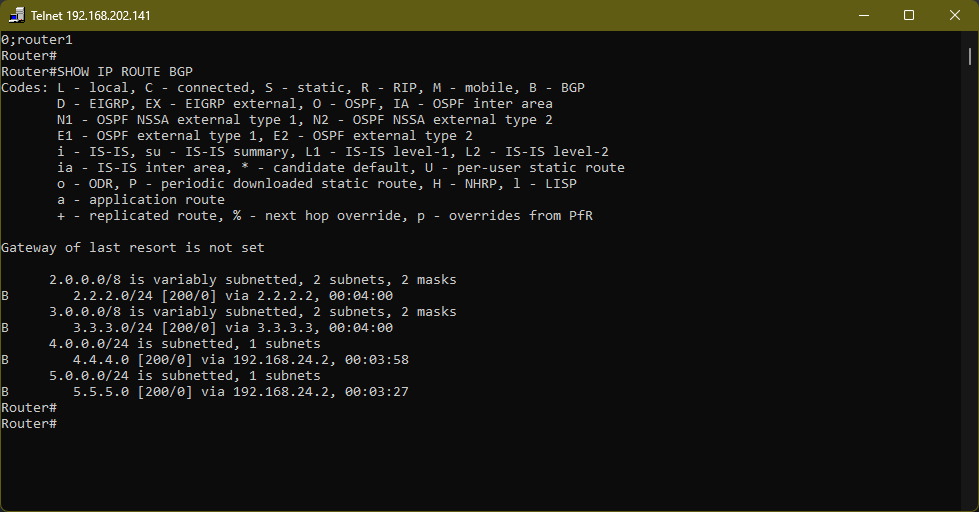

# Basic BGP Lab Multi-AS Routing (EVE-NG)

## Overview

A fully functional 4-Autonomous System BGP network built and verified end-to-end in EVE-NG with 12 routers. This lab covers the complete BGP configuration stack from physical interface addressing through OSPF IGP setup, iBGP full-mesh peering, eBGP inter-AS peering, and next-hop-self route propagation verified with a successful end-to-end ping from AS64900 to AS64915.

---

## Topology


### Autonomous Systems

| AS | Routers | Role |
|---|---|---|
| AS64900 | R1, R2, R3 | Origin AS |
| AS64905 | R4, R5 | Transit AS |
| AS64910 | R6, R7, R8, R9 | Transit AS |
| AS64915 | R10, R11, R12 | Destination AS |

### Device Inventory

| Device | Platform | Role |
|---|---|---|
| R1 | Cisco IOSv | AS64900 internal router |
| R2 | Cisco IOSv | AS64900 border router → R4 |
| R3 | Cisco IOSv | AS64900 border router → R4 |
| R4 | Cisco IOSv | AS64905 border router → R2, R3 |
| R5 | Cisco IOSv | AS64905 border router → R6, R7 |
| R6 | Cisco IOSv | AS64910 border router → R5 |
| R7 | Cisco IOSv | AS64910 border router → R5 |
| R8 | Cisco IOSv | AS64910 internal router |
| R9 | Cisco IOSv | AS64910 border router → R10, R11 |
| R10 | Cisco IOSv | AS64915 border router → R9 |
| R11 | Cisco IOSv | AS64915 border router → R9 |
| R12 | Cisco IOSv | AS64915 internal router |

---

## Network Design

### Point-to-Point Link Addressing (192.168.YY.x/24)

The lab uses a structured addressing scheme where the subnet reflects the two router numbers of each link. The lower-numbered router always gets .1, the higher-numbered router gets .2.

| Link | Subnet | Router A | Router B |
|---|---|---|---|
| R1 – R2 | 192.168.12.0/24 | R1: .1 | R2: .2 |
| R1 – R3 | 192.168.13.0/24 | R1: .1 | R3: .2 |
| R2 – R4 | 192.168.24.0/24 | R2: .1 | R4: .2 |
| R3 – R4 | 192.168.34.0/24 | R3: .1 | R4: .2 |
| R4 – R5 | 192.168.45.0/24 | R4: .1 | R5: .2 |
| R5 – R6 | 192.168.56.0/24 | R5: .1 | R6: .2 |
| R5 – R7 | 192.168.57.0/24 | R5: .1 | R7: .2 |
| R6 – R8 | 192.168.68.0/24 | R6: .1 | R8: .2 |
| R7 – R8 | 192.168.78.0/24 | R7: .1 | R8: .2 |
| R8 – R9 | 192.168.89.0/24 | R8: .1 | R9: .2 |
| R9 – R10 | 192.168.109.0/24 | R9: .1 | R10: .2 |
| R9 – R11 | 192.168.119.0/24 | R9: .1 | R11: .2 |
| R10 – R12 | 192.168.120.0/24 | R10: .1 | R12: .2 |
| R11 – R12 | 192.168.121.0/24 | R11: .1 | R12: .2 |

### Loopback Addressing (Y.Y.Y.Y/24)

Each router has a loopback interface using its router number as all four octets. Loopbacks act as the stable BGP identity for each router and never go down.

| Router | Loopback Address |
|---|---|
| R1 | 1.1.1.1/24 |
| R2 | 2.2.2.2/24 |
| R3 | 3.3.3.3/24 |
| R4 | 4.4.4.4/24 |
| R5 | 5.5.5.5/24 |
| R6 | 6.6.6.6/24 |
| R7 | 7.7.7.7/24 |
| R8 | 8.8.8.8/24 |
| R9 | 9.9.9.9/24 |
| R10 | 10.10.10.10/24 |
| R11 | 11.11.11.11/24 |
| R12 | 12.12.12.12/24 |

---

## Concepts Covered

### 1. BGP — Border Gateway Protocol
BGP is the routing protocol that connects different organizations' networks (Autonomous Systems) on the internet. Unlike IGPs which optimize for speed within a network, BGP optimizes for policy and path selection between networks.

### 2. eBGP — External BGP
Sessions between routers in **different** Autonomous Systems. Uses the directly connected interface IP as the neighbor address. No additional source configuration needed because the two routers share a physical link.

### 3. iBGP — Internal BGP
Sessions between routers in the **same** Autonomous System. Uses loopback addresses as neighbor addresses for stability. Requires `update-source loopback0` so the router uses its loopback as the BGP session source. Requires a full mesh every router in the AS must peer with every other router in the AS.

### 4. IGP (OSPF) as the Foundation for iBGP
iBGP sessions use loopback addresses, which are virtual interfaces with no physical cable. OSPF runs within each AS to advertise these loopbacks so every router can reach its iBGP peers' loopback addresses. Without OSPF, iBGP sessions would never form.

### 5. next-hop-self
When a border router learns routes via eBGP and passes them to iBGP peers, it advertises the original eBGP next-hop IP. Internal routers have no route to that external IP and drop packets. `next-hop-self` tells the border router to substitute its own address as the next-hop, making routes reachable for all internal routers.

---

## Configuration Step by Step

### Step 1 — Physical Interface IPs

Every point-to-point link gets its own subnet. Lower router number = .1, higher = .2. `no shutdown` required on all physical interfaces.

```
! Example — R1
interface ethernet0/1
 ip address 192.168.12.1 255.255.255.0
 no shutdown
interface ethernet0/0
 ip address 192.168.13.1 255.255.255.0
 no shutdown
```

### Step 2 — Loopback Interfaces

Loopbacks come up automatically no shutdown needed.

```
! Example — R1
interface loopback0
 ip address 1.1.1.1 255.255.255.0
```

### Step 3 OSPF Within Each AS

Each AS runs its own independent OSPF process. Advertise all loopbacks and all internal link subnets. Never advertise links that cross into another AS.

```
! Example — R8 (AS64910)
router ospf 1
 router-id 8.8.8.8
 network 8.8.8.0 0.0.0.255 area 0
 network 192.168.68.0 0.0.0.255 area 0
 network 192.168.78.0 0.0.0.255 area 0
 network 192.168.89.0 0.0.0.255 area 0
```

### Step 4 — BGP Configuration

Border routers get both iBGP and eBGP neighbors. Internal routers get only iBGP neighbors. Every router advertises its own loopback into BGP.

```
! Example — R9 (AS64910) — iBGP to R6, R7, R8 + eBGP to R10, R11
router bgp 64910
 bgp router-id 9.9.9.9
 neighbor 6.6.6.6 remote-as 64910
 neighbor 6.6.6.6 update-source loopback0
 neighbor 7.7.7.7 remote-as 64910
 neighbor 7.7.7.7 update-source loopback0
 neighbor 8.8.8.8 remote-as 64910
 neighbor 8.8.8.8 update-source loopback0
 neighbor 192.168.109.2 remote-as 64915
 neighbor 192.168.119.2 remote-as 64915
 network 9.9.9.0 mask 255.255.255.0
```

### Step 5 next-hop-self on Border Routers

Applied on all border routers toward their iBGP peers only.

```
! Example — R9
router bgp 64910
 neighbor 6.6.6.6 next-hop-self
 neighbor 7.7.7.7 next-hop-self
 neighbor 8.8.8.8 next-hop-self
```

---

## Key Commands Reference

### Verification
```
show ip interface brief          ! Confirm all interfaces up/up
show ip ospf neighbor            ! Confirm OSPF neighbors are FULL
show ip bgp summary              ! Confirm all BGP sessions Established
show ip route bgp                ! Confirm BGP routes in routing table
show ip bgp                      ! Full BGP table
```

### End-to-End Test
```
ping 12.12.12.12 source loopback0    ! From R1 — crosses all 4 ASes
```

### Troubleshooting
```
show running-config | section ospf   ! Verify OSPF config saved correctly
show running-config | section bgp    ! Verify BGP config saved correctly
ping 192.168.XX.X                    ! Test direct link before OSPF/BGP
```

---

## Verification

### BGP Summary — R1


### BGP Summary — R4 (Border Router)


### BGP Summary — R9 (Border Router)


### BGP Routes — R1 Routing Table


### End-to-End Ping — R1 to R12


---

## Lessons Learned

- OSPF must be fully converged before iBGP sessions can form always verify `show ip ospf neighbor` shows FULL before touching BGP
- Interface IPs assigned to the wrong physical port are one of the most common and hardest to spot issues always verify with `show ip interface brief` and ping across each link before moving to upper layers
- iBGP uses loopbacks + `update-source loopback0`, forgetting update-source is the most common reason iBGP sessions stay Idle
- `next-hop-self` is required on every border router; without it, internal routers have no route to external next-hops and all inter-AS traffic fails silently
- BGP sessions being established do not automatically mean traffic flows always verify with an actual end-to-end ping using `source loopback0`
- The `show running-config | section ospf` filter is case-sensitive in IOS use lowercase

---

## Tools Used

- EVE-NG Community Edition
- Cisco IOSv (vIOS) router images
- Cisco IOS CLI
