# SOC Home Lab, Attack Detection & Log Analysis


## Overview

This lab simulates a production Security Operations Centre (SOC) environment built entirely on VMware Workstation. The goal is to practice the complete SOC analyst workflow: design and build the infrastructure, monitor it with industry-standard tools, execute real attack scenarios from a dedicated attacker machine, and detect those attacks through SIEM correlation, log analysis, and a custom-built Splunk detection dashboard.

The lab demonstrates a full Active Directory attack chain  reconnaissance, credential brute force, domain compromise, SAM and LSA credential dumping, Pass-the-Hash lateral movement, and AS-REP Roasting,  showing how each stage leaves forensic evidence detectable through Splunk SPL queries and Wazuh real-time alerting.

**What this lab covers:**

- Network segmentation and zone-based firewall policy with pfSense across 4 subnets
- Endpoint detection and response with Wazuh SIEM across a Windows Active Directory environment
- Centralised log ingestion, threat hunting, and detection engineering with Splunk Enterprise 9.4.1
- Custom SOC Attack Overview Dashboard built in Splunk with 5 live detection panels
- Offensive simulation from Kali Linux  Nmap, SMB brute force, SAM and LSA dumping, Pass-the-Hash, AS-REP Roasting
- Full MITRE ATT&CK technique coverage across T1110.001, T1003.001, T1550.002, and T1558.004
- Alert triage methodology  distinguishing background noise from active attacks using Logon Type and Source IP analysis

---

## Lab Architecture

```
┌─────────────────────────────────────────────────────────────────┐
│                        VMware Workstation                        │
│                                                                  │
│  ┌──────────────┐    ┌────────────────────────────────────────┐ │
│  │   pfSense    │    │           Network Segments              │ │
│  │  Firewall    │    │                                         │ │
│  │  10.0.1.1    │    │  LAN         (10.0.1.0/24) → Kali      │ │
│  │  10.0.2.1    │    │  MONITORING  (10.0.2.0/24) → Ubuntu    │ │
│  │  10.0.3.1    │    │  ACTIVEDIR   (10.0.3.0/24) → Win VMs   │ │
│  │  10.0.4.1    │    │  VULNERABLE  (10.0.4.0/24) → Future    │ │
│  └──────────────┘    └────────────────────────────────────────┘ │
│                                                                  │
│  ┌──────────────────┐      ┌──────────────────┐                 │
│  │  Ubuntu Server   │      │   Kali Linux     │                 │
│  │  10.0.2.10       │      │   10.0.1.10      │                 │
│  │  Splunk 9.4.1    │      │   (Attacker)     │                 │
│  │  Wazuh 4.14.5    │      └──────────────────┘                 │
│  └──────────────────┘                                            │
│                                                                  │
│  ┌──────────────────┐      ┌──────────────────┐                 │
│  │  Windows Client  │      │  Windows Server  │                 │
│  │  10.0.3.101      │      │  10.0.3.2        │                 │
│  │  Windows 10 Ent  │      │  Server 2019     │                 │
│  │  Splunk UF       │      │  Active Directory│                 │
│  │  Wazuh Agent     │      │  Splunk UF       │                 │
│  └──────────────────┘      │  Wazuh Agent     │                 │
│                             └──────────────────┘                 │
└─────────────────────────────────────────────────────────────────┘
```

---

## Environment Specifications

| Component | Details |
|-----------|---------|
| Hypervisor | VMware Workstation 17.5 |
| Host Machine | AMD Ryzen 7 5800H, 16GB RAM |
| pfSense | 2.8.1-RELEASE (amd64) |
| Ubuntu Server | 24.04 LTS |
| Wazuh | v4.14.5 (Manager + Indexer + Dashboard) |
| Splunk | Enterprise 9.4.1 |
| Splunk Universal Forwarder | v10.2.2 on both Windows machines |
| Windows Client | Windows 10 Enterprise (Build 19045.3803) |
| Windows Server | Windows Server 2019 Standard + Active Directory (soc.local) |
| Attacker | Kali Linux 2026.1 |

---

## Network Design

pfSense acts as the central firewall and router across all lab segments. Each interface represents a distinct security zone, mirroring how enterprise networks isolate traffic by trust level.

| Interface | Zone | Subnet | Purpose |
|-----------|------|--------|---------|
| em0 | WAN | DHCP (192.168.202.x) | Internet access |
| em1 | LAN | 10.0.1.0/24 | Attacker machine (Kali) |
| em2 | MONITORING | 10.0.2.0/24 | SIEM and monitoring stack |
| em3 | ACTIVEDIRECTORY | 10.0.3.0/24 | Windows endpoints and AD |
| em4 | VULNERABLE | 10.0.4.0/24 | Reserved for future labs |

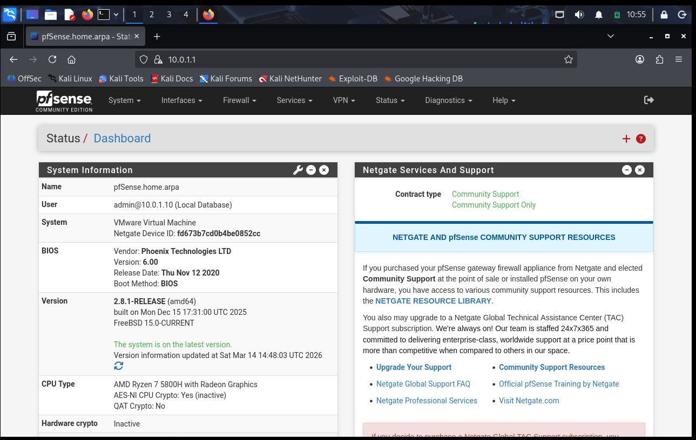
*pfSense showing all five network interfaces and operational status*

### Key Firewall Rules

| Rule | Interface | Source | Destination | Port | Purpose |
|------|-----------|--------|-------------|------|---------|
| Allow Splunk Forwarding | ACTIVEDIRECTORY | 10.0.3.0/24 | 10.0.2.10 | 9997/TCP | Windows log forwarding |
| Allow Kali to AD | LAN | 10.0.1.10 | 10.0.3.0/24 | Any | Attack simulation traffic |
| Allow LAN out | LAN | 10.0.1.0/24 | Any | Any | Internet access for Kali |

---

## Tools and Technologies

### Wazuh  SIEM and EDR

Deployed as an all-in-one installation on Ubuntu, providing real-time endpoint detection across both Windows machines. Wazuh automatically maps detected events to MITRE ATT&CK techniques and fires alerts during active attacks without requiring custom rule configuration.

| Agent ID | Hostname | IP | OS | Status |
|----------|----------|----|----|--------|
| 001 | Client01 | 10.0.3.101 | Windows 10 Enterprise | Active |
| 002 | WInServer | 10.0.3.2 | Windows Server 2019 | Active |

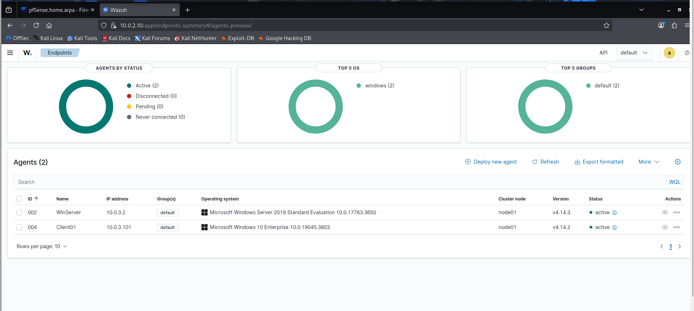
*Both Windows endpoints reporting as Active in Wazuh dashboard*

### Splunk Enterprise  Log Analysis and Detection Engineering

Primary platform for log ingestion, SPL-based threat hunting, alert creation, and the custom SOC dashboard. Windows Security and System event logs forward from both endpoints via Splunk Universal Forwarder over TCP 9997.

**Log pipeline:**

```
Windows Endpoints (Security.evtx + System.evtx)
        ↓  Splunk Universal Forwarder v10.2.2
        ↓  TCP Port 9997
        ↓  pfSense rule  ACTIVEDIRECTORY to MONITORING
        ↓
Ubuntu Splunk Server (10.0.2.10)
        ↓
Splunk index: main
        ↓
Analyst queries and dashboards
```

**Critical configuration:** `inputs.conf` must use `WinEventLog://` sourcetypes. Raw file monitoring assigns the `syslog` sourcetype which breaks all field extraction  EventCode, Account_Name, Logon_Type, and src_ip become unsearchable. The `WinEventLog://` API produces properly structured, fully parsed events.

```ini
[WinEventLog://Security]
index = main
sourcetype = WinEventLog:Security
disabled = false

[WinEventLog://System]
index = main
sourcetype = WinEventLog:System
disabled = false
```

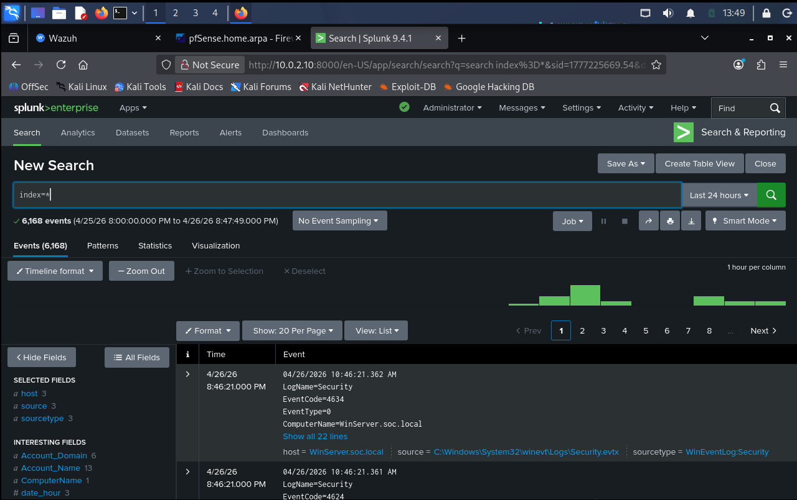
*WinEventLog:Security and WinEventLog:System sourcetypes confirmed active*

---

## Windows Security Event ID Reference

| Event ID | Description | SOC Relevance |
|----------|-------------|---------------|
| 4624 | Successful logon | Monitor for unusual times and sources |
| 4625 | Failed logon | Primary brute force indicator |
| 4648 | Logon with explicit credentials | Pass-the-Hash indicator |
| 4672 | Special privileges assigned | Admin access and credential dumping signal |
| 4720 | User account created | Persistence indicator |
| 4728 | User added to privileged group | Privilege escalation |
| 4768 | Kerberos TGT requested | AS-REP Roasting detection |
| 4771 | Kerberos pre-authentication failed | Kerberos brute force and password spray |
| 4776 | NTLM credential validation | NTLM brute force |
| 7045 | New service installed | Malware persistence |

---

## Phase 1  Reconnaissance

### Nmap Port Scan  Windows Client

```bash
nmap -sS -A 10.0.3.101
```

Open ports: 135 (MSRPC), 139 (NetBIOS), 445 (SMB)  Windows 10 Enterprise confirmed.

### Nmap Port Scan  Windows Server

```bash
nmap -sS -A 10.0.3.2
```

```
53/tcp    open  domain         Simple DNS Plus
88/tcp    open  kerberos-sec   Microsoft Windows Kerberos
135/tcp   open  msrpc
389/tcp   open  ldap           Microsoft AD LDAP (Domain: soc.local)
445/tcp   open  microsoft-ds
3268/tcp  open  ldap           Global Catalog
```

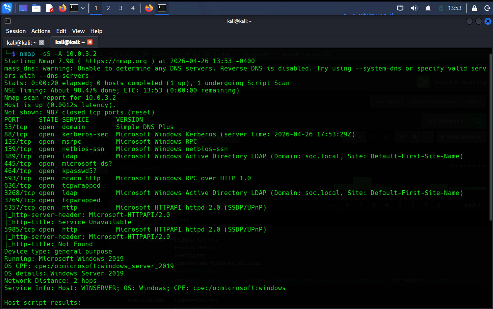
*Nmap aggressive scan confirming Windows Server 2019 as Domain Controller for soc.local*

Ports 88, 389, and 3268 together identify an Active Directory Domain Controller. From an attacker's perspective this immediately signals Kerberos attacks, LDAP enumeration, and credential dumping as the next moves.

---

## Phase 2  SMB Brute Force

**MITRE ATT&CK:** T1110.001  Brute Force: Password Guessing

```bash
netexec smb 10.0.3.2 -u Administrator -p /usr/share/wordlists/rockyou.txt --ignore-pw-decoding
```

netexec systematically tested 14,344,399 passwords from rockyou.txt over SMB port 445. Each failure generated a `EventCode 4625` on the server. The successful password produced a single `EventCode 4624`.

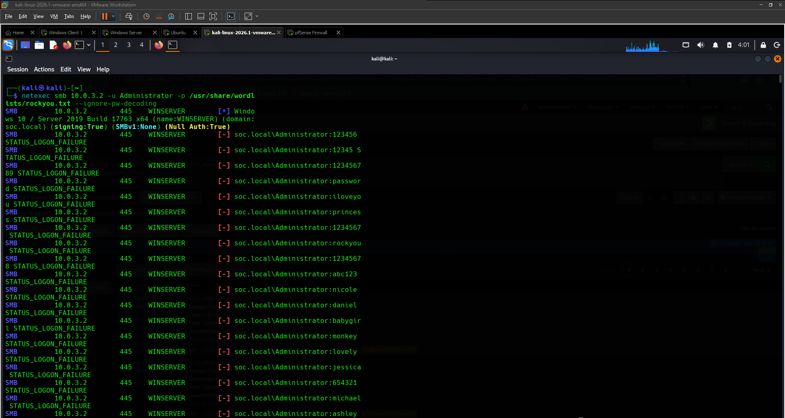
*netexec brute force  STATUS_LOGON_FAILURE on each attempt, ending with Pwn3d!*

```
SMB  10.0.3.2  445  WINSERVER  [-] soc.local\Administrator:123456 STATUS_LOGON_FAILURE
SMB  10.0.3.2  445  WINSERVER  [-] soc.local\Administrator:password STATUS_LOGON_FAILURE
...
SMB  10.0.3.2  445  WINSERVER  [+] soc.local\Administrator:Newpassword123 (Pwn3d!)
```

---

## Phase 3  Detection in Splunk

### Brute Force Detection

```splunk
index=main sourcetype=WinEventLog:Security EventCode=4625 Account_Name=Administrator
| stats count by src_ip, Account_Name, Logon_Type
```

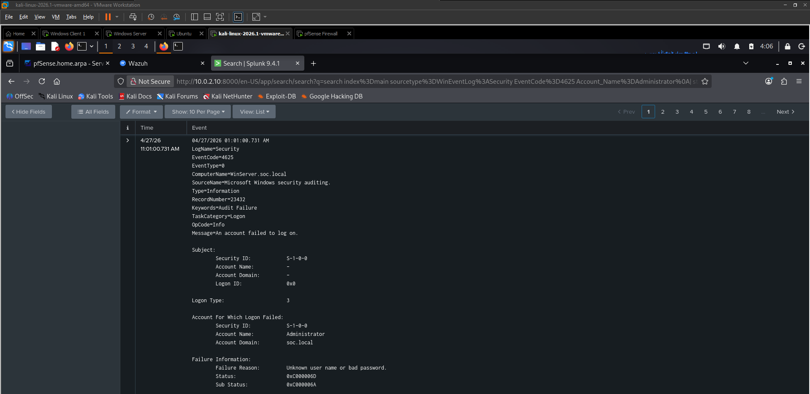
*Splunk confirming Logon Type 3 traffic from 10.0.1.10  remote SMB brute force identified*

**Expanded 4625 event analysis:**

| Indicator | Value | Meaning |
|-----------|-------|---------|
| Logon Type | 3 | Network logon via SMB  remote attack confirmed |
| Sub Status | 0xC000006A | Correct username, wrong password  brute force fingerprint |
| Source IP | 10.0.1.10 | Kali Linux  the attacker |
| Volume | 8,243 events | Automated tooling  no human types this fast |

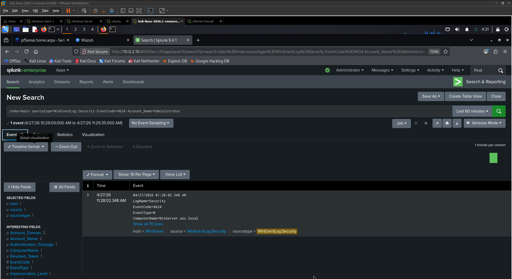
*Expanded EventCode 4625  Sub Status 0xC000006A and Logon Type 3 confirm the attack*

### Attack Volume Timechart

```splunk
index=main sourcetype=WinEventLog:Security EventCode=4625
| timechart span=10s count by Account_Name
```

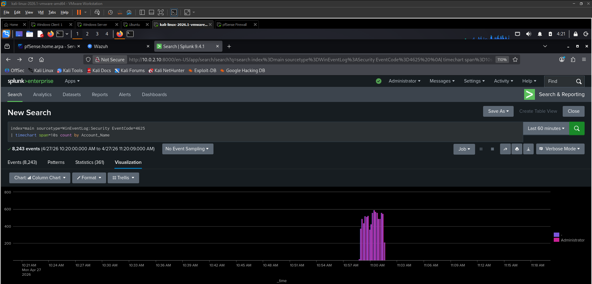
*8,243 events spiking between 10:57 and 11:00 AM  the automated tool signature is unmistakable*

The narrow spike confirms automated tooling. Human guessing produces low-frequency, irregular events. A spike of 600+ events per 10-second window is a tool, not a person.

### Critical Triage Skill  Noise vs Real Attack

Before the attack started, 279 failed logins appeared on the Administrator account. Same Event ID, completely different meaning:

| Field | Background Noise | Active Attack |
|-------|-----------------|---------------|
| Logon Type | 7 (screen unlock) | 3 (network/SMB) |
| Source IP | 127.0.0.1 (localhost) | 10.0.1.10 (external) |
| Process | svchost.exe | netexec over SMB |
| Volume | Low and irregular | Sustained high-frequency burst |

Logon Type and Source IP are the two fields that determine which is which. This is the core alert triage skill.

### Confirming the Breach

```splunk
index=main sourcetype=WinEventLog:Security EventCode=4624 Account_Name=Administrator
| table _time, Account_Name, ComputerName, Logon_Type, src_ip
| sort -_time
```

One `EventCode 4624` appeared among 8,243 failures:

```
Time:           04/27/2026 11:28:02 AM
EventCode:      4624
Account Name:   Administrator
Logon Type:     3
Elevated Token: Yes
Source IP:      10.0.1.10
```

Logon Type 3, Elevated Token Yes, source IP matching Kali  confirmed domain compromise.

---

## Phase 4  Post-Exploitation: Credential Dumping

**MITRE ATT&CK:** T1003.001  OS Credential Dumping: LSASS Memory

### LSA Secrets Dump

```bash
netexec smb 10.0.3.2 -u Administrator -p 'Newpassword123' --lsa
```

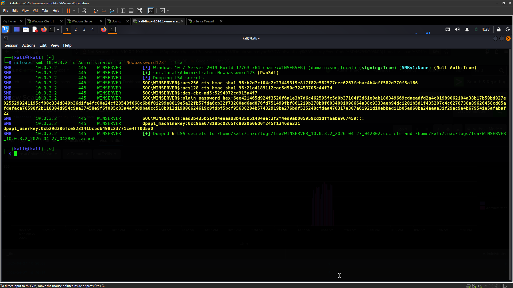
*netexec --lsa extracting 6 LSA secrets from WinServer including AES keys, NTLM hashes, and DPAPI machine key*

6 LSA secrets extracted: AES256 and AES128 Kerberos encryption keys, NTLM machine account hash, plain_password_hex equivalent, and DPAPI machine key.

### SAM Database Dump

```bash
netexec smb 10.0.3.2 -u Administrator -p 'Newpassword123' --sam
netexec smb 10.0.3.101 -u Administrator -p 'Newpassword123' --sam
```

SAM hashes extracted from both WINSERVER (3 hashes: Administrator, Guest, DefaultAccount) and CLIENT01 (5 hashes including User1  a domain-joined local account).

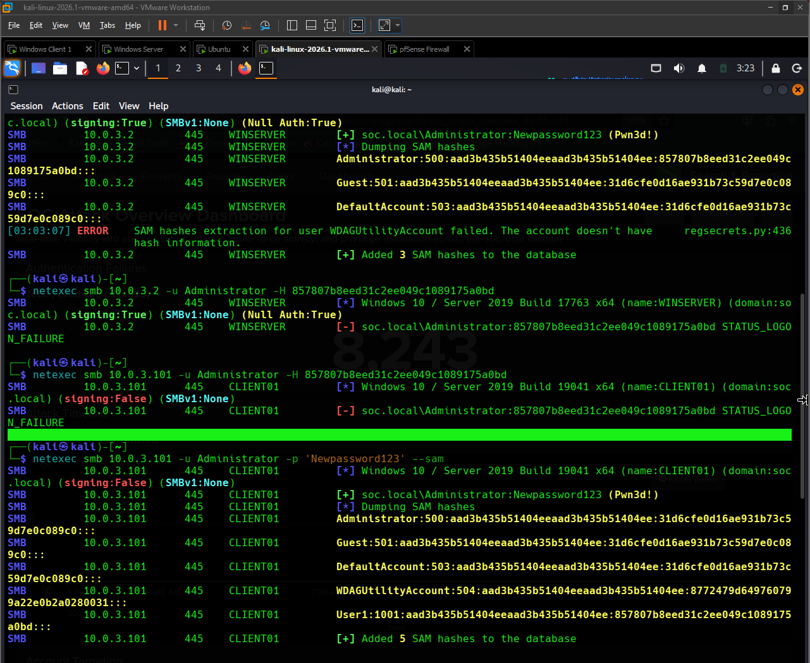
*SAM dumps from WINSERVER and CLIENT01  Administrator NTLM hash identical on both machines*

### Phase 5  Pass-the-Hash Lateral Movement Attempt

**MITRE ATT&CK:** T1550.002  Use Alternate Authentication Material: Pass-the-Hash

With the Administrator NTLM hash from the SAM dump, Pass-the-Hash was attempted against both machines:

```bash
netexec smb 10.0.3.2 -u Administrator -H 857807b8eed31c2ee049c1089175a0bd
netexec smb 10.0.3.101 -u Administrator -H 857807b8eed31c2ee049c1089175a0bd
```

Both returned `STATUS_LOGON_FAILURE`. The reason: Windows Server 2019 has credential protections enabled by default  specifically, the local Administrator account is protected against PtH via network logon when the account was used to set the initial domain. This is the expected behaviour in a hardened environment and demonstrates why detection engineers must understand both attack techniques and their mitigations.

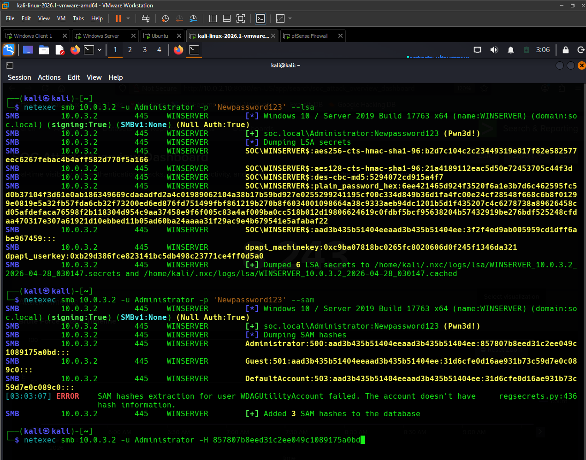
*PtH attempts against both machines  STATUS_LOGON_FAILURE confirms Windows credential protections active*

---

## Phase 6  AS-REP Roasting

**MITRE ATT&CK:** T1558.004  Steal or Forge Kerberos Tickets: AS-REP Roasting

AS-REP Roasting targets Active Directory accounts with Kerberos pre-authentication disabled. These accounts respond to unauthenticated TGT requests with an encrypted ticket that can be cracked offline  no credentials required.

```bash
netexec ldap 10.0.3.2 -u Administrator -p 'Newpassword123' --asreproast output.txt
```

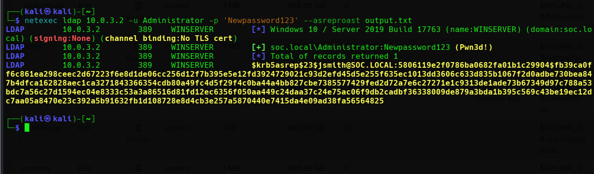
*netexec AS-REP Roast  jsmith Kerberos hash extracted and saved to output.txt for offline cracking*

The jsmith account responded with a full `$krb5asrep$23$` Kerberos hash  ready for offline cracking with hashcat or john. This means an attacker with this hash can attempt to recover jsmith's plaintext password without any further interaction with the domain.

### AS-REP Roasting Detection in Splunk

```splunk
index=main sourcetype=WinEventLog:Security EventCode=4768
| table _time, Account_Name, src_ip, Result_Code
```

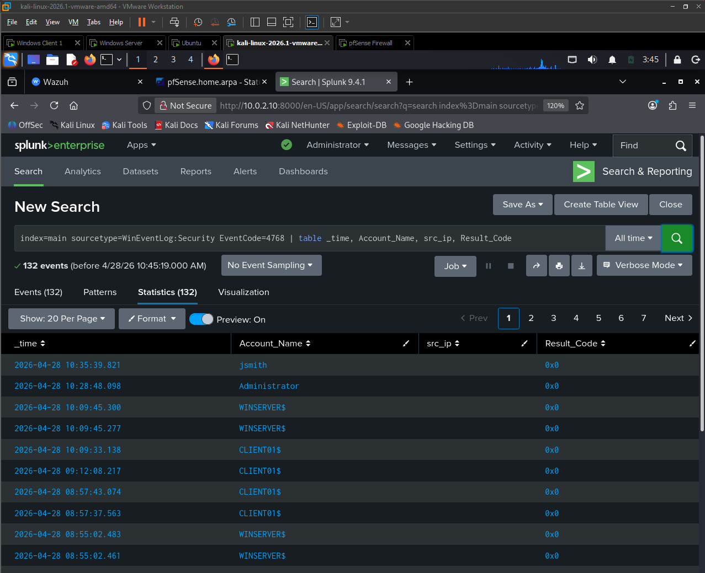
*Splunk EventCode 4768 showing 132 events  jsmith account visible with Result_Code 0x0 (TGT issued without pre-auth)*

132 EventCode 4768 events captured. The jsmith account appearing with Result_Code `0x0` (success) when no interactive session exists is the AS-REP Roasting detection signature. Normal TGT requests from domain-joined machines (WINSERVER$, CLIENT01$) provide the baseline for comparison.

---

## SOC Attack Overview Dashboard

A custom Splunk dashboard was built to provide real-time visibility across all attack phases.

**Dashboard name:** SOC Attack Overview Dashboard  
**URL:** `http://10.0.2.10:8000/en-US/app/search/soc_attack_overview_dashboard`


*Panel 1  Authentication Failures: 8,243 total EventCode 4625 events with brute force attack timeline showing the spike at 10:57–11:00 AM*

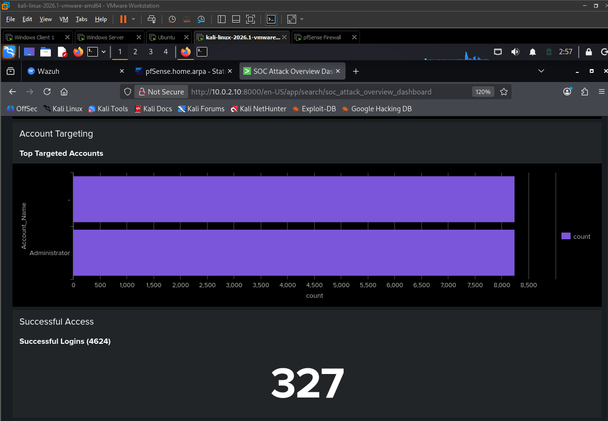
*Panel 2  Account Targeting: Top targeted accounts bar chart (Administrator dominant) and Successful Logins count (327 EventCode 4624 events)*

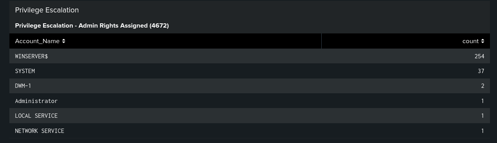
*Panel 3  Privilege Escalation: EventCode 4672 by account  Administrator entry with count 1 immediately post-breach is the credential dumping detection signal*

**Dashboard panels and their detection purpose:**

| Panel | SPL Basis | What It Detects |
|-------|-----------|-----------------|
| Total Failed Logins | EventCode 4625 count | Brute force volume at a glance |
| Brute Force Attack Timeline | 4625 timechart | Automated tooling signature  the spike |
| Top Targeted Accounts | 4625 stats by Account_Name | Identifies the account under attack |
| Successful Logins | EventCode 4624 count | Confirms breach when it follows a 4625 spike |
| Privilege Escalation | EventCode 4672 by Account_Name | SeDebugPrivilege assigned  credential dumping signal |

### Brute Force Threshold Alert

A Splunk saved alert was configured to trigger automatically when brute force conditions are met  no manual hunting required.

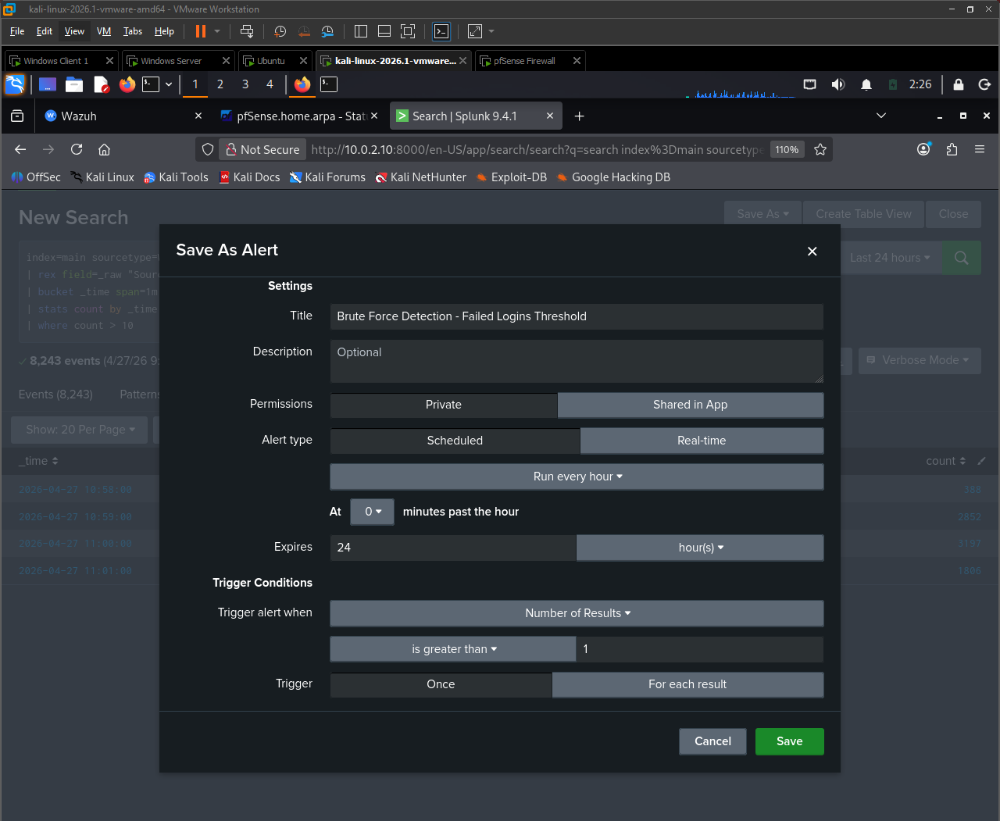
*Brute force statistics saved as a Splunk alert  automated detection without manual SPL queries*

---

## Complete Attack Chain Summary

```
[Kali Linux  10.0.1.10]
        │
        ├── 1. Nmap -sS -A ──────────────────────── Reconnaissance
        │          Identifies Domain Controller, open ports, OS
        │          No Windows event logs at this stage
        │
        ├── 2. netexec smb --rockyou ────────────── Brute Force   T1110.001
        │          8,243 × EventCode 4625
        │          Logon Type 3 | Sub Status 0xC000006A
        │          Spike visible in Splunk timechart
        │
        ├── 3. [+] Pwn3d! ───────────────────────── Breach Confirmed
        │          1 × EventCode 4624
        │          Logon Type 3 | Elevated Token: Yes
        │
        ├── 4. netexec --lsa + --sam ─────────────── Credential Dump   T1003.001
        │          6 LSA secrets from WINSERVER
        │          SAM hashes from WINSERVER and CLIENT01
        │          Detection: 4624 + 4672 correlation
        │
        ├── 5. netexec -H [NTLM hash] ───────────── Pass-the-Hash   T1550.002
        │          Attempted against both machines
        │          STATUS_LOGON_FAILURE  Windows protections active
        │          Detection: EventCode 4648
        │
        └── 6. netexec ldap --asreproast ─────────── AS-REP Roasting   T1558.004
                   jsmith hash extracted
                   Detection: EventCode 4768  TGT without pre-auth
```

---

## SPL Query Reference

```splunk
-- Verify log ingestion
index=main | stats count by sourcetype

-- All failed logons
index=main sourcetype=WinEventLog:Security EventCode=4625

-- Failed logons ranked by account
index=main sourcetype=WinEventLog:Security EventCode=4625
| stats count by Account_Name | sort -count

-- Brute force with source context
index=main sourcetype=WinEventLog:Security EventCode=4625 Account_Name=Administrator
| stats count by src_ip, Account_Name, Logon_Type

-- Attack volume timechart
index=main sourcetype=WinEventLog:Security EventCode=4625
| timechart span=10s count by Account_Name

-- Confirm breach after brute force
index=main sourcetype=WinEventLog:Security EventCode=4624 Account_Name=Administrator
| table _time, Account_Name, ComputerName, Logon_Type, src_ip | sort -_time

-- Privilege assignment post-compromise
index=main sourcetype=WinEventLog:Security EventCode=4672 Account_Name=Administrator
| table _time, Account_Name, Privilege_List

-- AS-REP Roasting detection
index=main sourcetype=WinEventLog:Security EventCode=4768
| table _time, Account_Name, src_ip, Result_Code

-- New services installed
index=main sourcetype=WinEventLog:System EventCode=7045

-- Event overview
index=main sourcetype=WinEventLog:Security
| stats count by EventCode | sort -count
```

---

## Lessons Learned

**Wazuh download timeouts**  The Wazuh Indexer package is 874MB and times out on slower connections. Running `sudo bash wazuh-install.sh -a -o` retries with an overwrite flag and resolves this cleanly.

**Splunk sourcetype misconfiguration**  Using `add monitor` with raw `.evtx` paths assigns the `syslog` sourcetype and breaks all Windows field extraction. The correct method is `WinEventLog://` in `inputs.conf` which uses the Windows Event Log API and produces fully parsed, searchable events.

**Cross-subnet routing blocked by default**  pfSense denies all inter-subnet traffic by default. Explicit rules were required on the ACTIVEDIRECTORY interface (TCP 9997 for Splunk) and LAN interface (any from Kali to AD subnet) before any log forwarding or attack traffic would flow.

**SMB tooling compatibility**  Hydra's SMB module does not support SMBv2/v3 required by Windows Server 2019. netexec handles modern SMB correctly and provides integrated post-exploitation modules including `--lsa`, `--sam`, and `--asreproast` for the full attack chain.

**Pass-the-Hash blocked by Windows credential protections**  Windows Server 2019 has network logon restrictions on local Administrator accounts enabled by default. PtH with NTLM hashes returns STATUS_LOGON_FAILURE against a hardened domain. Understanding why an attack fails is as important as understanding why it succeeds.

**Alert triage  same Event ID, different meaning**  EventCode 4625 can represent background noise (Logon Type 7, localhost) or an active attack (Logon Type 3, external IP). Logon Type and Source IP together determine which is which  this is the foundational triage skill for any SOC analyst.

**Credential dumping requires hunting, not just alerting**  Post-exploitation with valid credentials generates zero 4625 events. Detection requires correlating 4624 and 4672 together from anomalous source IPs. The dashboard Privilege Escalation panel was built specifically to surface this pattern without requiring manual SPL queries every shift.

---

## Next Steps

- Mimikatz in-memory execution and Sysmon EventCode 10 (LSASS process access) detection
- Deploy Suricata on pfSense for network-layer detection running alongside Wazuh endpoint detection
- Integrate pfSense firewall logs into Splunk for full network visibility alongside endpoint logs
- Golden Ticket attack using extracted Kerberos AES keys and EventCode 4769 detection
- Expand dashboard with Kerberos abuse panel covering AS-REP Roasting and Golden Ticket detection
- Convert detection logic to Sigma rules for portability across SIEM platforms

---

## Tools Used

| Tool | Version | Purpose |
|------|---------|---------|
| VMware Workstation | 17.5 | Hypervisor |
| pfSense | 2.8.1 | Firewall and network segmentation |
| Wazuh | 4.14.5 | SIEM and EDR |
| Splunk Enterprise | 9.4.1 | Log analysis, threat hunting, dashboards |
| Splunk Universal Forwarder | 10.2.2 | Windows log forwarding |
| Kali Linux | 2026.1 | Attack simulation platform |
| Nmap | 7.98 | Port scanning and OS fingerprinting |
| netexec | Latest | SMB brute force, SAM/LSA dump, PtH, AS-REP Roast |
| rockyou.txt | 14.3M entries | Password wordlist |

---

## References

- [Wazuh Documentation](https://documentation.wazuh.com)
- [Splunk Documentation](https://docs.splunk.com)
- [MITRE ATT&CK T1110.001](https://attack.mitre.org/techniques/T1110/001/)
- [MITRE ATT&CK T1003.001](https://attack.mitre.org/techniques/T1003/001/)
- [MITRE ATT&CK T1550.002](https://attack.mitre.org/techniques/T1550/002/)
- [MITRE ATT&CK T1558.004](https://attack.mitre.org/techniques/T1558/004/)
- [Windows Security Event IDs](https://www.ultimatewindowssecurity.com/securitylog/encyclopedia/)
- [pfSense Documentation](https://docs.netgate.com/pfsense/en/latest/)
- [netexec Documentation](https://www.netexec.wiki)

---

[](https://github.com/Otim24)
[](https://www.linkedin.com/in/timothy-otim-lutara)

*Part of the [nsec-portfolio](https://github.com/Otim24/nsec-portfolio)  documenting the path to CCNP Security and SOC Engineering.*
