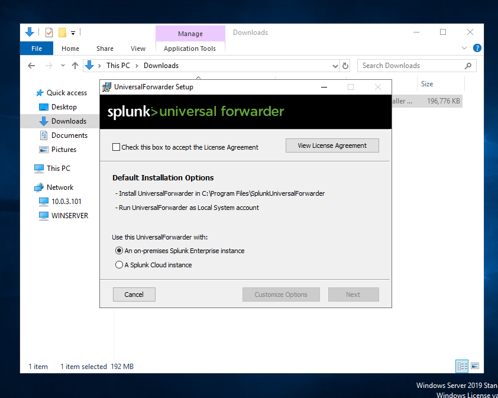
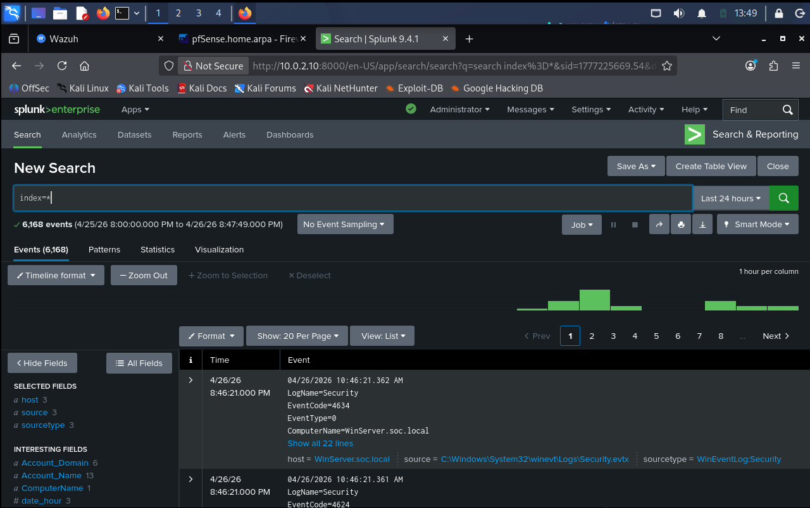
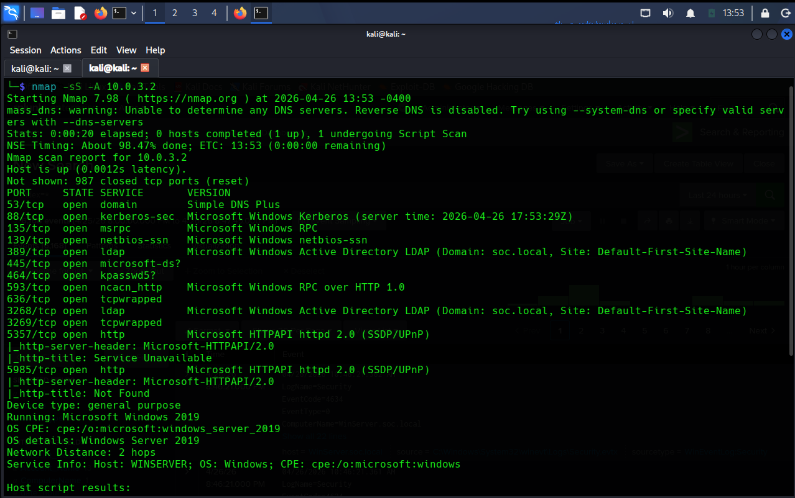
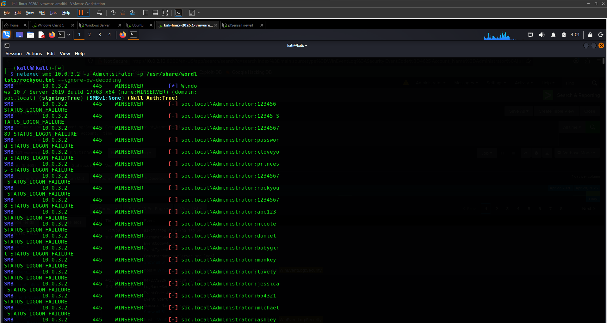
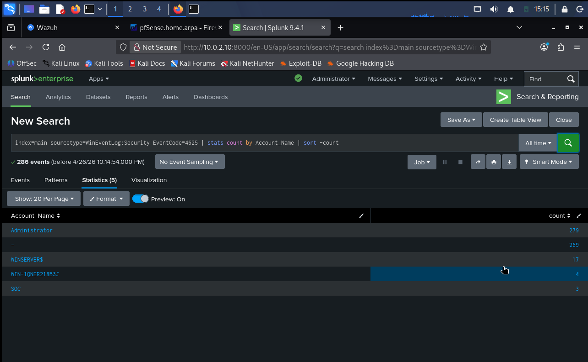
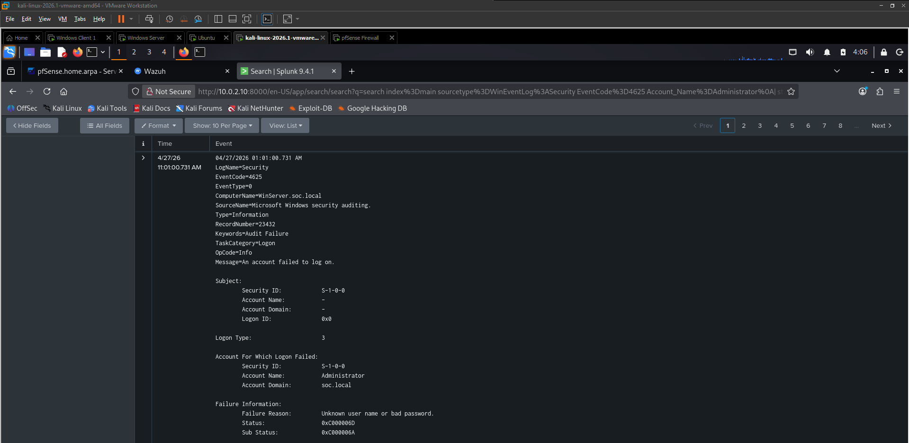
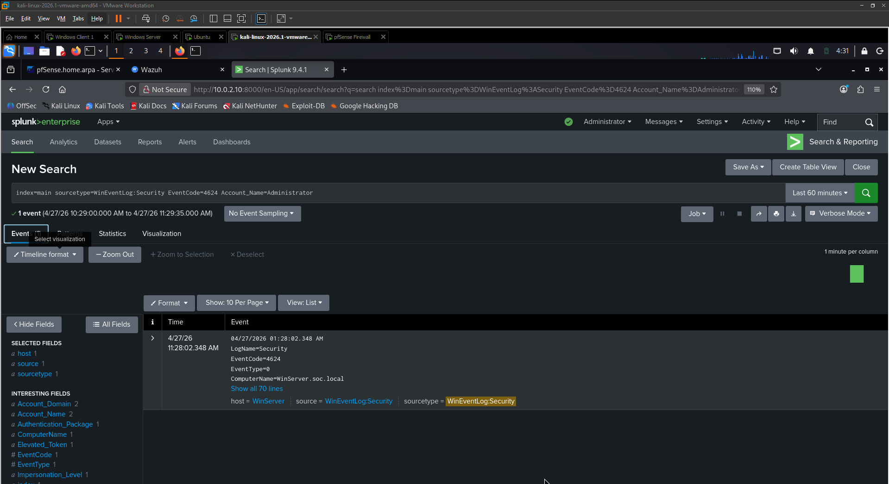
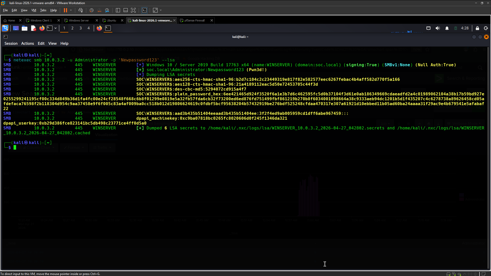

# SOC Home Lab Attack Detection & Log Analysis


---

## Overview

This lab simulates a real-world Security Operations Centre (SOC) environment built entirely on VMware Workstation. The goal is to practice the full SOC workflow: build the infrastructure, monitor it with industry-standard tools, attack it from a dedicated attacker machine, and detect those attacks through log analysis and SIEM correlation.

The lab demonstrates a complete attack lifecycle from initial reconnaissance and brute force through to successful credential theft and shows how each stage leaves forensic evidence that a SOC analyst can detect and investigate.

**The lab covers:**
- Network segmentation and firewall configuration with pfSense
- Endpoint monitoring and EDR with Wazuh SIEM
- Centralized log ingestion and analysis with Splunk Enterprise
- Offensive techniques using Kali Linux (Nmap, netexec)
- Detection engineering and threat hunting with SPL (Splunk Processing Language)
- Post-exploitation credential dumping (MITRE ATT&CK T1003.001)
- Failure vs. success event correlation — the "Smoke" vs. the "Fire."

---

## Lab Architecture

```
┌─────────────────────────────────────────────────────────────────┐
│                        VMware Workstation                        │
│                                                                  │
│  ┌──────────────┐    ┌────────────────────────────────────────┐ │
│  │   pfSense    │    │           Network Segments              │ │
│  │  Firewall    │    │                                         │ │
│  │  10.0.1.1    │    │  LAN (10.0.1.0/24)    → Kali Linux     │ │
│  │  10.0.2.1    │    │  MONITORING (10.0.2.0/24) → Ubuntu     │ │
│  │  10.0.3.1    │    │  ACTIVEDIR (10.0.3.0/24) → Win VMs     │ │
│  │  10.0.4.1    │    │  VULNERABLE (10.0.4.0/24) → Future use │ │
│  └──────────────┘    └────────────────────────────────────────┘ │
│                                                                  │
│  ┌──────────────────┐   ┌──────────────────┐                    │
│  │  Ubuntu Server   │   │   Kali Linux     │                    │
│  │  10.0.2.10       │   │   10.0.1.10      │                    │
│  │  ├─ Splunk 9.4.1 │   │   (Attacker)     │                    │
│  │  └─ Wazuh 4.14.5 │   └──────────────────┘                    │
│  └──────────────────┘                                            │
│                                                                  │
│  ┌──────────────────┐   ┌──────────────────┐                    │
│  │  Windows Client  │   │  Windows Server  │                    │
│  │  10.0.3.101      │   │  10.0.3.2        │                    │
│  │  Windows 10 Ent  │   │  Server 2019     │                    │
│  │  + Splunk UF     │   │  + Active Dir    │                    │
│  │  + Wazuh Agent   │   │  + Splunk UF     │                    │
│  └──────────────────┘   │  + Wazuh Agent   │                    │
│                          └──────────────────┘                    │
└─────────────────────────────────────────────────────────────────┘
```

---

## Environment Specifications

| Component | Details |
|-----------|---------|
| Hypervisor | VMware Workstation 17.5 |
| Host Machine | AMD Ryzen 7 5800H, 16GB RAM |
| pfSense | 2.8.1-RELEASE (amd64) |
| Ubuntu | 24.04 LTS (MONITORINGMACHINE) |
| Wazuh | v4.14.5 (Manager + Dashboard) |
| Splunk | Enterprise 9.4.1 |
| Windows Client | Windows 10 Enterprise (10.0.19045.3803) |
| Windows Server | Windows Server 2019 Standard Evaluation + Active Directory |
| Attacker | Kali Linux 2026.1 |

---

## Network Design

pfSense was configured as the central firewall and router connecting all lab segments. Each interface represents a different security zone, mirroring how enterprise networks isolate traffic by trust level.

| Interface | Name | Subnet | Purpose |
|-----------|------|--------|---------|
| em0 | WAN | DHCP (192.168.202.x) | Internet access |
| em1 | LAN | 10.0.1.0/24 | Analyst workstation (Kali) |
| em2 | MONITORINGMACHINE | 10.0.2.0/24 | SIEM & monitoring tools |
| em3 | ACTIVEDIRECTORY | 10.0.3.0/24 | Windows endpoints & AD |
| em4 | VULNERABLE | 10.0.4.0/24 | Reserved for future labs |


*pfSense dashboard showing all five network interfaces and their status*

### Key Firewall Rules Configured

| Rule | Interface | Source | Destination | Port | Purpose |
|------|-----------|--------|-------------|------|---------|
| Allow Splunk Forwarding | ACTIVEDIRECTORY | 10.0.3.0/24 | 10.0.2.10 | 9997/TCP | Log forwarding from Windows to Splunk |
| Allow Kali to AD | LAN | 10.0.1.10 | 10.0.3.0/24 | Any | Attack simulation from Kali |
| Allow LAN out | LAN | 10.0.1.0/24 | Any | Any | Internet access for Kali |

---

## Tools & Technologies

### Wazuh (SIEM + EDR)

Wazuh was deployed as an all-in-one installation on Ubuntu, providing endpoint detection and response (EDR) capabilities across both Windows endpoints.

**Components installed:**
- Wazuh Manager — central management and correlation engine
- Wazuh Indexer — OpenSearch-based log storage and indexing
- Wazuh Dashboard — web UI for alerts, agents, and visualizations

**Agents deployed:**

| Agent ID | Name | IP | OS | Status |
|----------|------|----|----|--------|
| 001 | Client01 | 10.0.3.101 | Windows 10 Enterprise | Active |
| 002 | WInServer | 10.0.3.2 | Windows Server 2019 | Active |


*Wazuh dashboard showing both Windows endpoints reporting as Active*

### Splunk Enterprise (Log Analysis & Threat Hunting)

Splunk was installed on the same Ubuntu machine to serve as the primary log analysis platform. Windows Event Logs are forwarded from both endpoints using the Splunk Universal Forwarder.

**Log pipeline:**
```
Windows Endpoints (Security.evtx + System.evtx)
        ↓  [Splunk Universal Forwarder v10.2.2]
        ↓  TCP Port 9997
        ↓  [pfSense — ACTIVEDIRECTORY → MONITORING firewall rule]
        ↓
Ubuntu Splunk Server (10.0.2.10:9997)
        ↓
Splunk Indexes (main)
        ↓
Analyst searches on Kali (http://10.0.2.10:8000)
```

---

## Phase 1 Infrastructure Setup

### 1.1 Wazuh Installation on Ubuntu

The official Wazuh installation assistant was used to deploy all components in a single-node configuration.

```bash
# Download the installer
curl -sO https://packages.wazuh.com/4.14/wazuh-install.sh

# Run all-in-one installation
sudo bash wazuh-install.sh -a
```

**Access:** `https://10.0.2.10` — credentials printed at end of installation.

### 1.2 Wazuh Agent Deployment on Windows

Agents were deployed on both Windows machines through the Wazuh Dashboard:

**Dashboard → Agents → Deploy new agent → Windows**

The installer was deployed via MSI and configured to point to the Wazuh Manager at `10.0.2.10`. Both endpoints appeared as Active agents within minutes.

### 1.3 Splunk Installation on Ubuntu

```bash
# Enable Splunk to receive data on port 9997
sudo /opt/splunk/bin/splunk enable listen 9997 -auth admin:<password>

# Start Splunk on boot
sudo /opt/splunk/bin/splunk enable boot-start
```

### 1.4 Splunk Universal Forwarder on Windows

The Splunk Universal Forwarder (v10.2.2) was installed on both Windows machines via the MSI wizard:

- **Receiving Indexer:** `10.0.2.10:9997`
- **Deployment Server:** None (standalone configuration)


*Splunk Universal Forwarder MSI setup wizard on Windows Server*

After installation, `inputs.conf` was configured manually to correctly parse Windows Event Logs:

**File:** `C:\Program Files\SplunkUniversalForwarder\etc\system\local\inputs.conf`

```ini
[WinEventLog://Security]
index = main
sourcetype = WinEventLog:Security
disabled = false

[WinEventLog://System]
index = main
sourcetype = WinEventLog:System
disabled = false
```

> **Why this matters:** Without this configuration, Splunk assigns the wrong sourcetype (`syslog`) to Windows Event Logs, preventing field extraction. Using `WinEventLog://` tells Splunk to use the Windows Event Log API directly, enabling proper parsing of `EventCode`, `Account_Name`, `IpAddress`, and `LogonType`.

```powershell
Restart-Service SplunkForwarder
```

### 1.5 Confirming Log Ingestion

```splunk
index=main | stats count by sourcetype
```

| Sourcetype | Count |
|------------|-------|
| WinEventLog:Security | 15,861 |
| WinEventLog:System | 4,084 |
| syslog (legacy) | 17,702 |


*Splunk confirming WinEventLog:Security and WinEventLog:System sourcetypes are active*

---

## Phase 2 Reconnaissance & Attack Simulation

### 2.1 Nmap Port Scan — Windows Client

**Attacker:** Kali Linux (`10.0.1.10`) | **Target:** Windows Client (`10.0.3.101`)

```bash
nmap -sS -A 10.0.3.101
```

**Results:**
```
PORT     STATE  SERVICE        VERSION
135/tcp  open   msrpc          Microsoft Windows RPC
139/tcp  open   netbios-ssn    Microsoft Windows netbios-ssn
445/tcp  open   microsoft-ds?
OS: Microsoft Windows 10 Enterprise
```

### 2.2 Nmap Port Scan Windows Server (Domain Controller)

**Target:** Windows Server (`10.0.3.2`)

```bash
nmap -sS -A 10.0.3.2
```

**Results:**
```
PORT     STATE  SERVICE         VERSION
53/tcp   open   domain          Simple DNS Plus
88/tcp   open   kerberos-sec    Microsoft Windows Kerberos
135/tcp  open   msrpc           Microsoft Windows RPC
139/tcp  open   netbios-ssn     Microsoft Windows netbios-ssn
389/tcp  open   ldap            Microsoft AD LDAP (Domain: soc.local)
445/tcp  open   microsoft-ds?
3268/tcp open   ldap            Microsoft AD LDAP (Global Catalog)
OS: Windows Server 2019 | Domain: soc.local
```


*Nmap aggressive scan identifying Windows Server 2019 as a Domain Controller*

> **SOC Note:** Ports 88 (Kerberos), 389 (LDAP), and 3268 (Global Catalog) immediately identify this machine as an Active Directory Domain Controller a high-value target. An attacker knowing this will pivot to Kerberos attacks, LDAP enumeration, and credential dumping.

### 2.3 SMB Brute Force Attack Windows Server

**MITRE ATT&CK:** T1110.001 Brute Force: Password Guessing  
**Tool:** netexec (successor to CrackMapExec)  
**Target:** `Administrator` account on `10.0.3.2`

```bash
netexec smb 10.0.3.2 -u Administrator -p /usr/share/wordlists/rockyou.txt --ignore-pw-decoding
```

netexec connected over SMB port 445 and systematically tested 14,344,399 passwords from the rockyou wordlist, generating a high-volume stream of authentication failures each one becoming a `EventCode 4625` on the target machine.


*netexec running SMB brute force — STATUS_LOGON_FAILURE on each attempt, ending with Pwn3d!*

**What the attacker sees:**
```
SMB  10.0.3.2  445  WINSERVER  [-] soc.local\Administrator:123456 STATUS_LOGON_FAILURE
SMB  10.0.3.2  445  WINSERVER  [-] soc.local\Administrator:password STATUS_LOGON_FAILURE
SMB  10.0.3.2  445  WINSERVER  [-] soc.local\Administrator:iloveyou STATUS_LOGON_FAILURE
...
SMB  10.0.3.2  445  WINSERVER  [+] soc.local\Administrator:Newpassword123 (Pwn3d!)
```

Each `[-]` line = one `EventCode 4625` logged on the server. The `[+] (Pwn3d!)` = one `EventCode 4624`. This is the entire attack story visible from the Windows Security log.

---

## Phase 3 — Detection & Threat Hunting in Splunk

### Windows Event ID Reference

| Event ID | Category | Description | SOC Relevance |
|----------|----------|-------------|---------------|
| 4624 | Authentication | Successful logon | Baseline monitor for unusual times/sources |
| 4625 | Authentication | Failed logon | Brute force indicator |
| 4634 | Authentication | Account logoff | Session tracking |
| 4648 | Authentication | Logon with explicit credentials | Pass-the-Hash indicator |
| 4672 | Privilege | Special privileges assigned at logon | Admin access tracking |
| 4720 | Account Mgmt | User account created | Persistence indicator |
| 4724 | Account Mgmt | Password reset attempt | Account takeover indicator |
| 4728 | Account Mgmt | User added to privileged group | Privilege escalation |
| 4771 | Kerberos | Kerberos pre-auth failed | AS-REP Roasting / password spray |
| 4776 | Authentication | Credential validation attempt | NTLM brute force |
| 7045 | System | New service installed | Malware persistence |
| 4698 | Scheduled Tasks | Scheduled task created | Persistence mechanism |

### 3.1 Verify Log Ingestion

```splunk
index=main | stats count by sourcetype
```

### 3.2 Failed Logon Detection

```splunk
index=main sourcetype=WinEventLog:Security EventCode=4625
```

**Finding:** 8,529 failed logon events recorded during the brute force simulation window.

### 3.3 Identify Most Targeted Accounts

```splunk
index=main sourcetype=WinEventLog:Security EventCode=4625 
| stats count by Account_Name 
| sort -count
```


*Splunk stats showing Administrator account as the primary target with 8,529 failures*

| Account Name | Failed Attempts | Analysis |
|-------------|----------------|----------|
| Administrator | 8,529 | RITICAL Automated brute force confirmed |
| - (blank) | 269 | Service authentication failures background noise |
| WINSERVER$ | 17 | Machine account normal AD traffic |
| WIN-1QNER218B3J | 4 | Machine account authentication |
| SOC | 3 | Local account manual errors |

### 3.4 Real-Time Brute Force Detection

```splunk
index=main sourcetype=WinEventLog:Security EventCode=4625 Account_Name=Administrator
| stats count by src_ip, Account_Name, Logon_Type
```


*Splunk isolating the brute force traffic — Logon Type 3 from 10.0.1.10 (Kali)*

**Expanding an individual 4625 event during the attack:**

```
EventCode=4625
ComputerName=WinServer.soc.local
Account Name: Administrator
Account Domain: soc.local
Failure Reason: Unknown user name or bad password
Status: 0xC000006D
Sub Status: 0xC000006A
Logon Type: 3
Source Network Address: 10.0.1.10
```


*Expanded EventCode 4625 showing Logon Type 3 (Network/SMB) and Sub Status 0xC000006A*

| Indicator | Value | Meaning |
|-----------|-------|---------|
| **Logon Type** | 3 | Network logon via SMB confirms remote attack |
| **Sub Status** | 0xC000006A | Correct username, wrong password brute force fingerprint |
| **Status** | 0xC000006D | Authentication failure |
| **Source IP** | 10.0.1.10 | Kali Linux the attacker |
| **Volume** | 8,529 in one window | Confirms automated tool, not a human |

**Distinguishing Noise from Real Attacks:**

Earlier in the lab, 279 failed logins appeared on Administrator before any attack was launched. Those events showed:
- **Logon Type 7** (screen unlock) not Type 3 (network)
- **Source: 127.0.0.1** (localhost) not an external IP
- **svchost.exe** — a Windows service, not an attack tool

This is a critical SOC skill two events can have the same Event ID but mean completely different things depending on Logon Type and Source IP.

### 3.5 Visualizing Attack Volume

```splunk
index=main sourcetype=WinEventLog:Security EventCode=4625 Account_Name=Administrator
| timechart count span=1m
```

**Key Findings:**
- Total events during simulation: **8,529 failed authentication attempts**
- All traffic targeted the **Administrator** account exclusively
- The timechart spike confirms automated tooling — human guessing would show irregular, low-frequency events, not a sustained high-frequency burst

### 3.6 Detecting the Successful Breach — EventCode 4624

After the brute force succeeded, a single `EventCode 4624` appeared amid thousands of failures. This is the most critical event it marks confirmed compromise.

```splunk
index=main sourcetype=WinEventLog:Security EventCode=4624 Account_Name=Administrator
| table _time, Account_Name, ComputerName, Logon_Type, src_ip
| sort -_time
```

**The Smoking Gun Event:**
```
Time:           04/27/2026 11:28:02 AM
EventCode:      4624
Account Name:   Administrator
Account Domain: soc.local
Computer:       WinServer.soc.local
Logon Type:     3  (Network — SMB)
Elevated Token: Yes
Source IP:      10.0.1.10  ← Kali Linux
```

Every field confirms the breach Logon Type 3 (SMB), Elevated Token (full admin), Source IP matching Kali, timing immediately after the 4625 spike.

### 3.7 Failure vs. Success, The Complete Attack Picture

| Detail | Failed Attempt (The Smoke) | Successful Breach (The Fire) |
|--------|---------------------------|------------------------------|
| **Event ID** | 4625 | 4624 |
| **Logon Type** | 3 (Network/SMB) | 3 (Network/SMB) |
| **Status** | 0xC000006A — Wrong Password | Audit Success |
| **Volume** | 8,529 events | 1 event |
| **Elevated Token** | N/A | Yes — Full Admin |
| **SOC Action** | Alert & investigate | Incident declared — contain immediately |

---

## Phase 4 Post-Exploitation: Credential Dumping

### 4.1 LSA Secrets Dump

**MITRE ATT&CK:** T1003.001 OS Credential Dumping: LSASS Memory

Once valid credentials were obtained, the attacker moved to post-exploitation — extracting credential material from the server's memory without ever touching the disk.

```bash
netexec smb 10.0.3.2 -u Administrator -p 'Newpassword123' --lsa
```


*netexec --lsa output showing 6 LSA secrets successfully dumped from WinServer*

**Output (sanitized):**
```
SMB  10.0.3.2  445  WINSERVER  [+] soc.local\Administrator:Newpassword123 (Pwn3d!)
SMB  10.0.3.2  445  WINSERVER  [*] Dumping LSA secrets
SMB  10.0.3.2  445  WINSERVER  SOC\WINSERVER$:aes256-cts-hmac-sha1-96:[HASH REDACTED]
SMB  10.0.3.2  445  WINSERVER  SOC\WINSERVER$:aes128-cts-hmac-sha1-96:[HASH REDACTED]
SMB  10.0.3.2  445  WINSERVER  SOC\WINSERVER$:des-cbc-md5:[HASH REDACTED]
SMB  10.0.3.2  445  WINSERVER  SOC\WINSERVER$:plain_password_hex:[HASH REDACTED]
SMB  10.0.3.2  445  WINSERVER  dpapi_machinekey:[HASH REDACTED]
SMB  10.0.3.2  445  WINSERVER  [+] Dumped 6 LSA secrets
```

**What was extracted:**

| Secret | Type | Attacker Use |
|--------|------|-------------|
| AES256/AES128 keys | Kerberos encryption keys | Golden/Silver Ticket attacks |
| NTLM hash | Machine account hash | Pass-the-Hash lateral movement |
| plain_password_hex | Cleartext equivalent | Direct authentication anywhere in the domain |
| DPAPI Machine Key | Data protection key | Decrypt locally stored credentials & certificates |

### 4.2 Why This Attack Is Harder to Detect

This is a "quiet" attack. Because the attacker is using a **valid password**, standard failed login alerts (`EventCode 4625`) do not trigger. Detection requires hunting for the combination of a successful logon followed immediately by privileged activity:

```splunk
index=main sourcetype=WinEventLog:Security EventCode=4624 Account_Name=Administrator Logon_Type=3
| table _time, Account_Name, src_ip, Logon_Type, Elevated_Token
```

Combined with:

```splunk
index=main sourcetype=WinEventLog:Security EventCode=4672 Account_Name=Administrator
| table _time, Account_Name, Privilege_List
```

`EventCode 4672` fires when special privileges are assigned including `SeDebugPrivilege`, which is required to access LSASS process memory. Finding 4624 + 4672 together from an unusual source IP is the detection signal for credential dumping.

---

## Phase 5 — Cross-Platform Detection with Wazuh

Wazuh provides real-time endpoint detection independent of Splunk. With both agents active during the attacks:

- **Brute force alerts:** Wazuh automatically generated alerts for the sustained 4625 spike
- **MITRE ATT&CK mapping:** Alerts mapped to T1110 (Brute Force) automatically in the dashboard
- **Real-time vs historical:** Wazuh fires alerts in real-time during an attack; Splunk enables deep historical hunting and correlation after the fact
- **Complementary coverage:** Wazuh catches things Splunk doesn't (file integrity changes, rootkit detection) and Splunk enables custom queries Wazuh's built-in rules don't cover

---

## Complete Attack Flow Summary

```
[Kali 10.0.1.10]
      │
      ├─ 1. Nmap -sS -A ────────────────────── Reconnaissance
      │       Open ports reveal Domain Controller  (No Windows logs generated)
      │
      ├─ 2. netexec smb --rockyou ──────────── Brute Force T1110.001
      │       8,529 × EventCode 4625           (Massive 4625 spike in Splunk)
      │       Logon Type 3, Source: 10.0.1.10
      │       Sub Status 0xC000006A
      │
      ├─ 3. [+] Pwn3d! ─────────────────────── Successful Breach
      │       1 × EventCode 4624              (Single 4624 after 8,529 failures)
      │       Logon Type 3, Elevated Token: Yes
      │       Source IP: 10.0.1.10
      │
      └─ 4. netexec smb --lsa ──────────────── Credential Dumping T1003.001
              6 LSA secrets extracted         (4624 + 4672 hunt with SPL)
              AES keys, NTLM hashes, DPAPI
```

---

## SPL Query Reference

```splunk
-- Verify sourcetypes
index=main | stats count by sourcetype

-- All failed logins
index=main sourcetype=WinEventLog:Security EventCode=4625

-- Failed logins by account (ranked)
index=main sourcetype=WinEventLog:Security EventCode=4625 
| stats count by Account_Name | sort -count

-- Brute force detection with source context
index=main sourcetype=WinEventLog:Security EventCode=4625 Account_Name=Administrator
| stats count by src_ip, Account_Name, Logon_Type

-- Attack volume timechart
index=main sourcetype=WinEventLog:Security EventCode=4625 Account_Name=Administrator
| timechart count span=1m

-- Find successful breach after brute force
index=main sourcetype=WinEventLog:Security EventCode=4624 Account_Name=Administrator
| table _time, Account_Name, ComputerName, Logon_Type, src_ip | sort -_time

-- Detect privilege use post-compromise
index=main sourcetype=WinEventLog:Security EventCode=4672 Account_Name=Administrator
| table _time, Account_Name, Privilege_List

-- New services installed (persistence)
index=main sourcetype=WinEventLog:System EventCode=7045

-- Top event types overview
index=main sourcetype=WinEventLog:Security 
| stats count by EventCode | sort -count
```

---

## Lessons Learned

**1. Wazuh Indexer Download Timeout**
The Wazuh Indexer package is 874MB. On slower connections it times out mid-download. Resolution: run `sudo bash wazuh-install.sh -a -o` which retries with an overwrite flag.

**2. Splunk Sourcetype Misconfiguration**
Using `add monitor` with raw `.evtx` file paths assigned the wrong sourcetype (`syslog`), breaking all field extraction. The correct method is `WinEventLog://` in `inputs.conf` which uses the Windows Event Log API and produces properly structured, fully searchable events.

**3. Cross-Subnet Routing**
pfSense blocked all inter-subnet traffic by default. Explicit firewall rules were required on the ACTIVEDIRECTORY interface (port 9997 for Splunk) and on the LAN interface (any port from Kali to AD) before any log forwarding or attack traffic could flow.

**4. SMB Brute Force Tooling**
Hydra's SMB module does not support SMBv2/v3 required by Windows Server 2019. netexec handles modern SMB correctly and also provides post-exploitation modules like `--lsa` for the full attack chain.

**5. Alert Triage**
The same Event ID (4625) can represent background noise (Logon Type 7, source 127.0.0.1) or an active attack (Logon Type 3, external source IP). Logon Type and Source IP are the two fields that determine which is which.

**6. Credential Dumping is Silent**
Post-exploitation with valid credentials generates no 4625 events. Detection requires correlating 4624 + 4672 from unusual source IPs — not just watching for failures.

---

## Next Steps

- [ ] Pass-the-Hash attack using dumped NTLM hashes (EventCode 4648)
- [ ] AS-REP Roasting against Active Directory (EventCode 4771)
- [ ] Create Splunk alert for brute force threshold (>10 failures/minute from same IP)
- [ ] Build Splunk SOC dashboard with attack overview panels
- [ ] Integrate pfSense firewall logs into Splunk for network-layer visibility
- [ ] Deploy Suricata IDS on pfSense for network-based detection
- [ ] Mimikatz in-memory execution and Sysmon EventCode 10 detection

---

## Tools Used

| Tool | Version | Purpose |
|------|---------|---------|
| VMware Workstation | 17.5 | Hypervisor |
| pfSense | 2.8.1 | Firewall & network segmentation |
| Wazuh | 4.14.5 | SIEM + EDR |
| Splunk Enterprise | 9.4.1 | Log analysis & threat hunting |
| Splunk Universal Forwarder | 10.2.2 | Windows log forwarding |
| Kali Linux | 2026.1 | Attack simulation platform |
| Nmap | 7.98 | Port scanning & OS fingerprinting |
| netexec | Latest | SMB brute force & post-exploitation |
| rockyou.txt | — | Password wordlist (14.3M entries) |

---

## Screenshots Index

| File | Description | Section |
|------|-------------|---------|
| `pfsense-dashboard.png` | pfSense dashboard showing all network interfaces | Network Design |
| `wazuh-agents-active.png` | Wazuh showing both Windows agents as Active | Tools |
| `splunk-forwarder-install.png` | Splunk Universal Forwarder MSI wizard | Phase 1.4 |
| `splunk-sourcetypes-confirmed.png` | WinEventLog sourcetypes confirmed in Splunk | Phase 1.5 |
| `nmap-scan-winserver.png` | Nmap scan identifying Windows Server as Domain Controller | Phase 2.2 |
| `smb-brute-attack.png` | netexec brute force showing STATUS_LOGON_FAILURE stream | Phase 2.3 |
| `accounts-targeted-failed-logins.png` | Splunk stats — 8,529 failures on Administrator | Phase 3.3 |
| `smb-brute-detection-splunk.png` | Splunk EventCode 4625 during attack — Logon Type 3 | Phase 3.4 |
| `event-4625-expanded.png` | Expanded 4625 showing Sub Status 0xC000006A | Phase 3.4 |
| `credential-dumping-lsa.png` | netexec --lsa output — 6 LSA secrets dumped | Phase 4.1 |

---

## References

- [Wazuh Documentation](https://documentation.wazuh.com)
- [Splunk Documentation](https://docs.splunk.com)
- [MITRE ATT&CK T1110 — Brute Force](https://attack.mitre.org/techniques/T1110/)
- [MITRE ATT&CK T1003.001 — LSASS Memory](https://attack.mitre.org/techniques/T1003/001/)
- [Windows Security Event IDs](https://www.ultimatewindowssecurity.com/securitylog/encyclopedia/)
- [pfSense Documentation](https://docs.netgate.com/pfsense/en/latest/)
- [netexec Documentation](https://www.netexec.wiki)

---

*Part of the [nsec-portfolio](https://github.com/Otim24/nsec-portfolio) — documenting my path to CCNP Security and SOC Engineering.*
