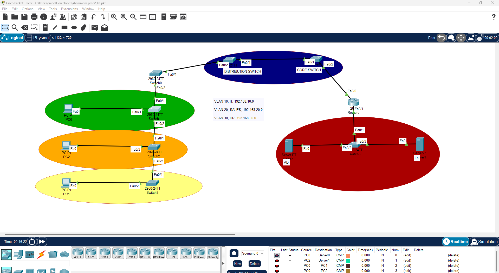
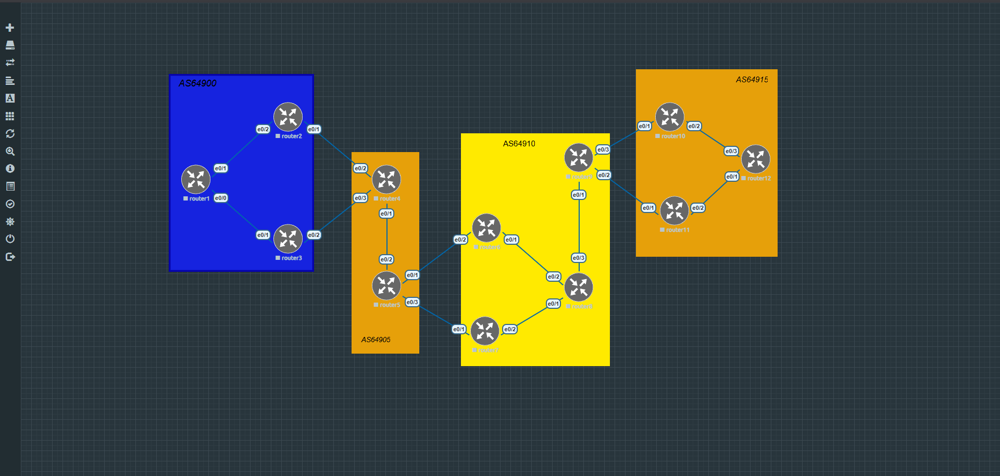
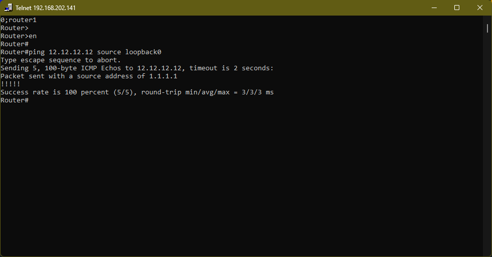

<table border="0" cellspacing="0" cellpadding="0">
<tr>
<td>

# Network Security Engineering Portfolio


</td>
<td>


</td>
</tr>
</table>

## 👤 About Me

I'm **Timothy Otim Lutara**, a cybersecurity student and aspiring Network Security Engineer based in Kampala, Uganda. This repository documents my hands-on journey through enterprise networking, network security, and security operations, building toward **CCNP Security** and a career at the intersection of network engineering and security operations.

I learn by doing. Every lab here represents a real concept I've configured, broken, debugged, and understood from the ground up, not a tutorial I followed passively.

> *"I'm building practical skills across enterprise networking, firewall administration, SIEM, IDS/IPS, and threat intelligence because the best network security engineers understand both how networks are built and how they are attacked."*

---

## 🗂️ Repository Structure

```
nsec-portfolio/
│
├── 01-enterprise-switching/           
│   └── Packet Tracer VLANs, Trunking, VTP, Router-on-a-Stick, DHCP
│
├── 02-eve-ng-enterprise-network/      
│   └── EVE-NG Full enterprise topology, OSPF, FortiGate, inter-VLAN routing, internet NAT
│
├── 03-bgp-lab/
│   └── EVE-NG Multi-AS BGP topology, OSPF IGP, iBGP full mesh, eBGP inter-AS, next-hop-self
│
└── 06-soc-lab/                        
    └── VMware pfSense, Splunk, Suricata, Windows Server AD, Kali Linux
```

> Additional labs are in active development.

---

## Labs

---

### Lab 01, Enterprise Switching (Cisco Packet Tracer)

**Platform:** Cisco Packet Tracer  
**Focus:** Layer 2 Switching | VLAN Design | Inter-VLAN Routing

This was my first enterprise switching lab, covering the full Layer 2 to Layer 3 switching stack using Cisco Packet Tracer. The topology simulates a small campus network with multiple VLANs and a Router-on-a-Stick configuration for inter-VLAN routing.

**Technologies Implemented:**
- VLAN creation and port assignment
- 802.1Q Trunking between switches and router
- VTP (VLAN Trunking Protocol) for VLAN propagation
- Router-on-a-Stick inter-VLAN routing
- DHCP configuration with per-VLAN address pools
- STP (Spanning Tree Protocol) root bridge configuration

  **Screenshot Full Topology:**

  

📁 [View Lab →](./01-enterprise-switching/)

---

### Lab 02, EVE-NG Enterprise Network Lab

**Platform:** EVE-NG on VMware Workstation  
**Focus:** Enterprise Network Engineering | Routing & Switching | Firewall Integration

A full multi-floor enterprise office network built and verified end-to-end in EVE-NG. This lab goes significantly beyond basic switching implementing a complete network stack from access layer VPCs through to internet connectivity via a FortiGate next-generation firewall.

**Topology:** 4 access switches → Layer 3 core switch → edge router → FortiGate firewall → internet

**Technologies Implemented:**
- Multi-VLAN design with floor-based segmentation (Finance, HR, Marketing, IT)
- VTP Server/Client domain for centralized VLAN management
- 802.1Q explicit trunk configuration with DTP disabled (`switchport nonegotiate`)
- Layer 3 core switch with SVIs as default gateways per VLAN
- Routed uplink port (`no switchport`) between core switch and router
- OSPF dynamic routing (Area 0) with default route redistribution
- DHCP relay (`ip helper-address`) forwarding broadcasts across Layer 3 boundaries
- FortiGate VM64 firewall interface config, static routing, NAT, firewall policy
- Full end-to-end verification: VPC → access switch → core → router → FortiGate → 8.8.8.8

**Screenshot Full Topology:**


**Screenshot Internet Connectivity Verified:**


📁 [View Lab →](./02-eve-ng-enterprise-network/)  
📄 [Read Full Report →](./02-eve-ng-enterprise-network/Enterprise-Network-Lab-Report.pdf)

---

### Lab 03, Basic BGP Lab (EVE-NG)

**Platform:** EVE-NG  
**Focus:** Border Gateway Protocol | Multi-AS Routing | iBGP | eBGP | next-hop-self

A fully functional 4-Autonomous System BGP network built and verified end-to-end in EVE-NG with 12 routers across AS64900, AS64905, AS64910, and AS64915. Configured OSPF as the IGP within each AS to enable iBGP loopback reachability, established a full iBGP mesh within each AS, and configured eBGP peering across all AS boundaries. Verified with a successful end-to-end ping from R1 (AS64900) to R12 (AS64915).

**Technologies Implemented:**
- 4 Autonomous Systems with 12 routers across a structured point-to-point topology
- Loopback interfaces (Y.Y.Y.Y/24) as stable BGP router identities
- OSPF (Area 0) within each AS as the IGP foundation for iBGP loopback reachability
- iBGP full mesh within each AS using loopback addresses and `update-source loopback0`
- eBGP peering across all AS boundaries using direct link IPs
- `next-hop-self` on all border routers for correct route propagation to iBGP peers
- End-to-end verified: R1 (AS64900) → R12 (AS64915) ping successful across all 4 ASes

**Screenshot Full Topology:**



**Screenshot End-to-End Ping R1 → R12:**



📁 [View Lab →](./03-bgp-lab/)

---

### Lab 06, SOC Home Lab

**Platform:** VMware Workstation  
**Focus:** Security Operations | SIEM | IDS/IPS | Threat Detection

A full SOC analyst lab environment built on VMware Workstation with a virtualized enterprise network including Active Directory, endpoint monitoring, network intrusion detection, and centralized log analysis via Splunk.

**Lab Environment (~95GB):**
- **pfSense** — Perimeter firewall and network gateway
- **Ubuntu Server** — Linux server for services and log forwarding
- **Windows Server 2019** — Active Directory Domain Controller
- **Windows 10 Client** — Domain-joined endpoint
- **Kali Linux** — Attacker machine for simulated attack scenarios
- **Splunk** — SIEM for log ingestion, dashboards, and alerting
- **Suricata** — Network IDS/IPS for traffic inspection and alerting

📁 [View Lab →](./06-soc-labs/)
📄 [Read Full Report →](./03-bgp-lab/BGP-Lab-Report.pdf)

---

## 🌍 Connect With Me

[](https://github.com/Otim24)
[](https://www.linkedin.com/in/timothy-otim-lutara)

---

## License

This project is licensed under the **MIT License** see the [LICENSE](./LICENSE) file for details.

---

*Built with curiosity. Configured with purpose. Broken on purpose.*
